# CLD Web3 Cloud Storage — System Architecture

This document describes the architecture of **CLD** (Web3 Cloud Storage) as implemented in this repository. It is written for software engineers who need to understand how the system is built, why it is built that way, and what constraints apply when extending or operating it.

CLD is a hybrid decentralized application: **file metadata** is recorded on an Ethereum-compatible smart contract, while **file content** is stored on a centralized Express server (with optional IPFS replication via Pinata). The browser acts as the orchestration layer, connecting MetaMask, the REST API, client-side encryption, and on-chain transactions.

---

## Table of Contents

1. [Architectural Overview](#1-architectural-overview)
2. [Design Philosophy and Key Decisions](#2-design-philosophy-and-key-decisions)
3. [Component Architecture](#3-component-architecture)
4. [Inter-Component Communication](#4-inter-component-communication)
5. [Authentication Architecture](#5-authentication-architecture)
6. [Storage Architecture](#6-storage-architecture)
7. [Encryption Architecture](#7-encryption-architecture)
8. [Smart Contract Architecture](#8-smart-contract-architecture)
9. [Frontend Architecture](#9-frontend-architecture)
10. [Deployment Topology](#10-deployment-topology)
11. [Advantages and Limitations](#11-advantages-and-limitations)
12. [Current Architectural Constraints](#12-current-architectural-constraints)
13. [Scalability Considerations](#13-scalability-considerations)
14. [Future Evolution Possibilities](#14-future-evolution-possibilities)

---

## 1. Architectural Overview

CLD separates concerns across three runtime tiers that communicate over well-defined protocols:

| Tier | Runtime | Primary Responsibility |
|------|---------|------------------------|
| **Presentation & orchestration** | Browser (SPA) | User interaction, encryption, wallet signing, contract calls |
| **Application & blob storage** | Node.js / Express | HTTP API, disk storage, SIWE/JWT auth, optional IPFS pinning |
| **Metadata registry** | Hardhat local chain | Per-wallet file catalog (hash, name, size, IPFS CID, encryption flag) |

The system does **not** store file bytes on-chain. The smart contract functions as an **append-only metadata registry** scoped to `msg.sender`, not as a content delivery network or access control layer for blob storage.

### System Context Diagram

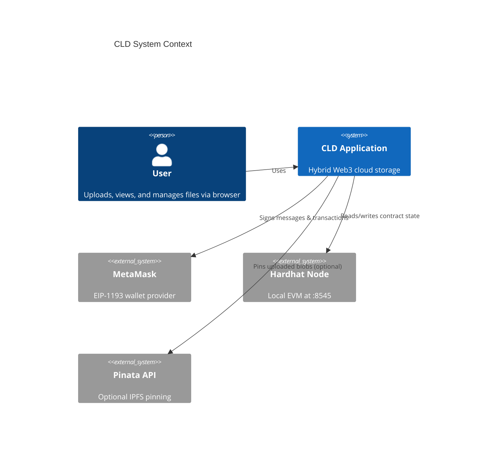

### End-to-End Request Topology

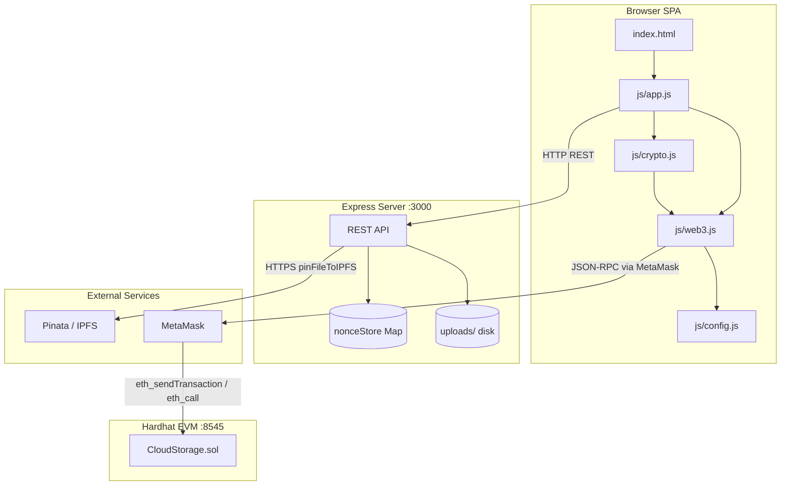

---

## 2. Design Philosophy and Key Decisions

### 2.1 Hybrid Storage Model

**Decision:** Store file content on a traditional server filesystem; store only metadata on-chain.

**Why this exists:** Storing multi-megabyte blobs on an EVM chain is economically and technically infeasible for a school-project-scale demo. The contract instead records a **content-addressed identifier** (`fileId` = SHA-256 of stored bytes), a human-readable name, size, timestamp, optional IPFS CID, and an encryption flag. This gives the application a "Web3" ownership narrative (your wallet owns the catalog entry) without paying gas proportional to file size.

**Trade-off accepted:** Blob availability and access control are decoupled from on-chain ownership. A user who knows a `fileId` can download the blob from the server without proving wallet ownership (see [Section 12](#12-current-architectural-constraints)).

### 2.2 Client-Side Encryption

**Decision:** Encryption and decryption occur entirely in the browser using the Web Crypto API (AES-256-GCM). The server never receives encryption keys.

**Why this exists:** This is the primary confidentiality mechanism. Even though the server stores ciphertext opaquely, the design ensures the operator cannot read encrypted files without the user's wallet-derived key. The on-chain `isEncrypted` flag informs the UI to run the decrypt path on download/preview.

**Trade-off accepted:** Key derivation depends on a wallet signature over a fixed message. Key recovery across devices/sessions depends on signature determinism, which is wallet-implementation-dependent and not verified in this codebase.

### 2.3 Custom SIWE-Like Authentication (Not Full SIWE Library)

**Decision:** Implement a lightweight Sign-In With Ethereum flow using a server-issued nonce, a fixed message format, `ethers.verifyMessage`, and JWT issuance.

**Why this exists:** The server needs a stateless way to authenticate HTTP requests for protected operations (currently: file delete). Wallet connection alone does not produce an HTTP credential; SIWE bridges Web3 identity to REST auth.

**Scope in implementation:** JWT is required only for `DELETE /api/files/:fileId`. Upload and download endpoints are unauthenticated.

### 2.4 Hardhat Local Network as the Default Chain

**Decision:** Target chain ID `31337` (`0x7a69`), RPC `http://127.0.0.1:8545`, contract address written to `js/config.js` at deploy time.

**Why this exists:** Zero-cost local development, instant block times, and predictable contract addresses (Hardhat's first deploy address). The deploy script auto-generates frontend configuration so the SPA and contract stay synchronized after redeployment.

**Trade-off accepted:** No production network configuration exists in `hardhat.config.js`. The application is architected for local demo, not mainnet deployment.

### 2.5 Optional IPFS via Pinata

**Decision:** After disk persistence, the server optionally pins the same file to IPFS through Pinata's REST API when `PINATA_API_KEY` and `PINATA_SECRET_KEY` are set.

**Why this exists:** Provides a secondary, content-addressed replication path and enables public gateway sharing (`https://gateway.pinata.cloud/ipfs/{cid}`). The IPFS CID is stored on-chain alongside the SHA-256 `fileId`.

**Trade-off accepted:** Pinning is synchronous within the upload request (awaited before response). If Pinata fails, upload still succeeds with an empty `ipfsHash`. Encrypted files pinned to IPFS remain ciphertext at the gateway.

### 2.6 Vanilla JavaScript SPA (No Build Step)

**Decision:** Single-page application composed of static HTML, CSS, and four JavaScript modules loaded via `<script>` tags. Ethers.js loaded from CDN.

**Why this exists:** Minimizes toolchain complexity for a school project. No bundler, no framework, no transpilation. The deploy script writes `config.js`; everything else is hand-authored.

**Trade-off accepted:** No module system, no type checking, global function scope for action handlers (`viewFileAction`, etc.), and manual script load order dependency.

---

## 3. Component Architecture

### 3.1 Smart Contract — `contracts/CloudStorage.sol`

**Purpose:** Per-wallet metadata registry.

**Why it exists:** Provides tamper-evident, wallet-scoped file catalog with event emissions for an activity timeline. It is the source of truth for *what files a wallet claims to own*, not for *who may read bytes from disk*.

**Data model:**

```solidity
struct File {
    string fileId;        // SHA256 hash of stored content
    string ipfsHash;      // IPFS CID (empty if not pinned)
    string fileName;      // Display name (not content-addressed)
    uint256 fileSize;
    uint256 uploadTime;
    address owner;
    bool isEncrypted;
}
mapping(address => File[]) private userFiles;
```

**Operations:**

| Function | Mutability | Purpose |
|----------|------------|---------|
| `uploadFile` | nonpayable | Append metadata for `msg.sender` |
| `getMyFiles` | view | Return full array for `msg.sender` |
| `getFile` | view | Return single entry by index |
| `getFileCount` | view | Return array length |
| `deleteFile` | nonpayable | Swap-and-pop removal by index |
| `renameFile` | nonpayable | Update display name only |

**Events:** `FileUploaded`, `FileDeleted`, `FileRenamed` — consumed by the frontend activity log via `contract.queryFilter`.

### 3.2 Backend — `server.js`

**Purpose:** HTTP gateway, blob persistence, authentication, and optional IPFS integration.

**Why it exists:** Browsers cannot write to local disk or call Pinata with secret keys. The Express server is the **blob storage authority** and the **secret holder** for JWT signing and Pinata credentials.

**Internal subsystems:**

| Subsystem | Implementation | Purpose |
|-----------|------------------|---------|
| Security middleware | Helmet, CORS, rate limiters | Baseline HTTP hardening |
| Static hosting | `express.static(__dirname)` | Serves SPA from project root |
| SIWE auth | `nonceStore` Map + JWT | Wallet-to-HTTP identity bridge |
| Upload pipeline | Multer disk storage + SHA-256 rename | Content-addressed blob storage |
| IPFS pinning | `pinToIPFS()` via `form-data` | Optional secondary storage |
| File serving | `GET /api/files/:fileId` | Blob retrieval by hash prefix |

**Environment dependencies:**

| Variable | Required | Effect if missing |
|----------|----------|-------------------|
| `PORT` | No | Defaults to `3000` |
| `JWT_SECRET` | No | Random 32-byte hex generated at startup (tokens invalidated on restart) |
| `PINATA_API_KEY` | No | IPFS pinning skipped; `ipfsHash` always empty |
| `PINATA_SECRET_KEY` | No | Same as above |

### 3.3 Frontend Modules

#### `js/config.js` (auto-generated)

**Purpose:** Single source of frontend runtime configuration.

**Why it exists:** Contract address and ABI change on every redeploy. The deploy script (`scripts/deploy.js`) writes this file atomically after deployment, preventing manual address/ABI drift.

**Contains:** Network parameters (chain ID, RPC URL, chain name), server URL, contract address, full contract ABI.

**Known inconsistency:** Deploy script writes `NETWORK.currency`, but `js/web3.js` reads `NETWORK.nativeCurrency` when adding a chain to MetaMask. The fallback defaults to ETH naming if `nativeCurrency` is undefined.

#### `js/web3.js`

**Purpose:** All blockchain and wallet interaction.

**Why it exists:** Isolates ethers.js usage, SIWE flow, and contract method wrappers from UI code. Maintains module-level state: `provider`, `signer`, `contract`, `userAddress`, `authToken`.

**Responsibilities:**
- MetaMask connection and chain switching (`wallet_switchEthereumChain` / `wallet_addEthereumChain`)
- Contract instantiation with signer
- Automatic SIWE after connect
- CRUD wrappers: `uploadFileOnChain`, `getFilesFromChain`, `deleteFileOnChain`, `renameFileOnChain`
- Activity log via event filtering
- Wallet event listeners (chain/account change → page reload)

#### `js/crypto.js`

**Purpose:** Client-side file encryption (`CLDCrypto` namespace).

**Why it exists:** Keeps cryptographic operations separate from UI and Web3 logic. Uses Web Crypto API subtile operations unavailable in Node without polyfills on the server side.

**Key lifecycle:** Derived on first encrypt/decrypt, cached in `_encKey` for the session, clearable via `clearKey()`.

#### `js/app.js`

**Purpose:** Application orchestration and UI logic.

**Why it exists:** Largest module; binds DOM events to backend and chain operations. Implements page routing, file upload pipeline, list rendering, search, category filtering, modals, and global action functions invoked from inline `onclick` handlers.

#### `index.html` + `style.css`

**Purpose:** UI shell and presentation.

**Why they exist:** `index.html` defines page structure (Home, My Files, Activity, Shared), modals, and script load order. `style.css` (~1,600 lines) implements a dark Web3-themed responsive layout with mobile sidebar, FAB upload button, and preview modals.

**Shared page status:** The "Shared" navigation item renders a static empty state. No dedicated shared-files logic exists in `app.js`.

### 3.4 Deployment Tooling

#### `hardhat.config.js`

**Purpose:** Solidity 0.8.19 compilation and localhost network definition.

**Why it exists:** Standard Hardhat entry point. Only `localhost:8545` network is configured.

#### `scripts/deploy.js`

**Purpose:** Deploy contract and regenerate `js/config.js`.

**Why it exists:** Ensures frontend and backend share the same contract address post-deploy. Reads ABI from Hardhat artifacts at `artifacts/contracts/CloudStorage.sol/CloudStorage.json`.

---

## 4. Inter-Component Communication

### 4.1 Communication Matrix

| From | To | Protocol | Data Exchanged |
|------|----|----------|----------------|
| Browser | Express | HTTP REST | Files (multipart), auth messages, JWT |
| Browser | Hardhat (via MetaMask) | JSON-RPC (EIP-1193) | Signed transactions, eth_call, event logs |
| Express | Pinata | HTTPS multipart | File stream → IPFS CID |
| Express | Local disk | Filesystem | Read/write under `uploads/` |
| `app.js` | `web3.js` | Global function calls | Contract ops, wallet state |
| `app.js` | `crypto.js` | Global `CLDCrypto` object | Encrypt/decrypt ArrayBuffers |
| `web3.js` | `config.js` | Global `CONFIG` object | Address, ABI, URLs |
| Deploy script | Artifacts + config | Filesystem | ABI extraction, config generation |

### 4.2 Upload Sequence (Full Path)

This diagram shows the complete multi-system upload flow, including optional encryption and the two-phase commit (server then chain).

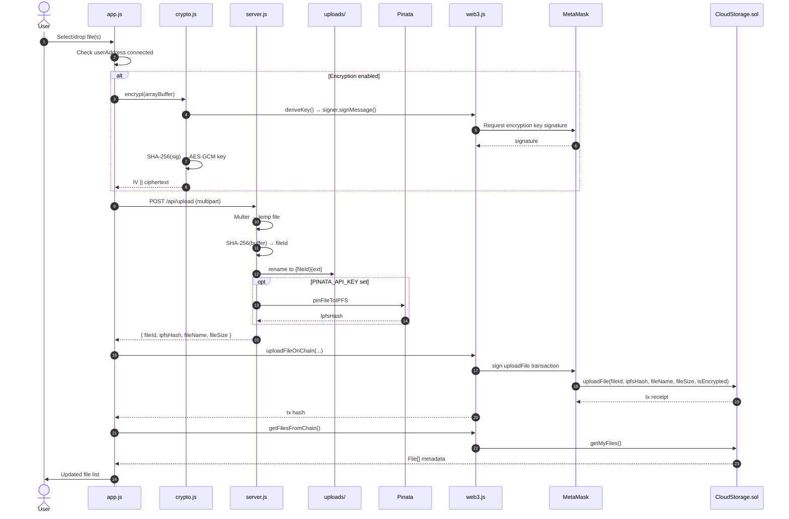

### 4.3 Download / Preview Sequence

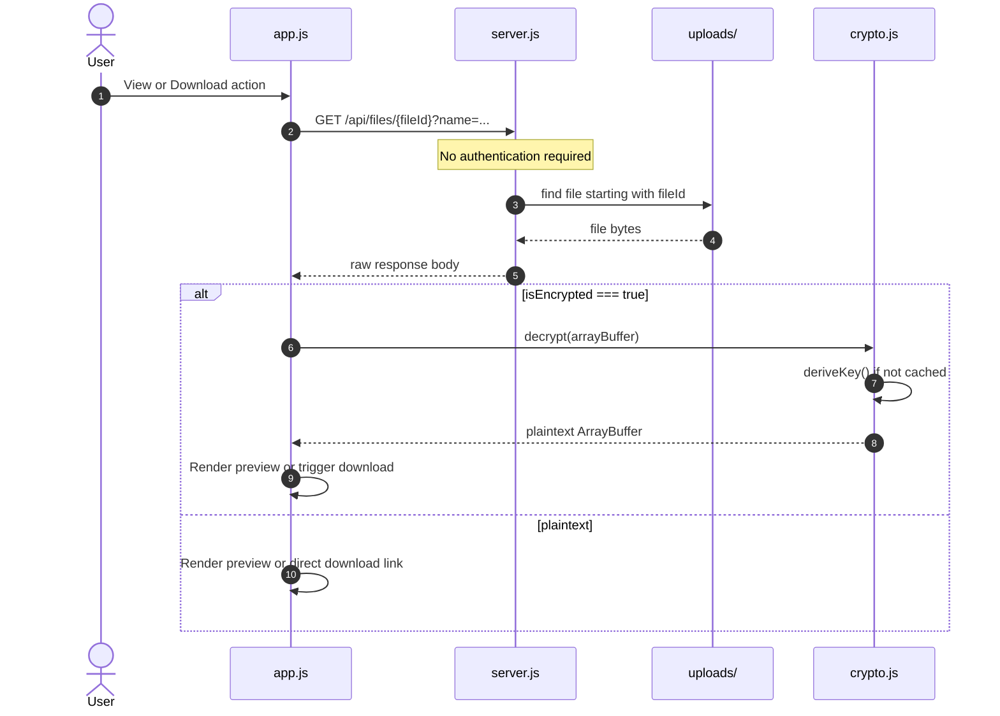

### 4.4 Delete Sequence (Dual Mutation)

Delete is the only user flow that mutates **both** server state and chain state. Order: server first, then chain.

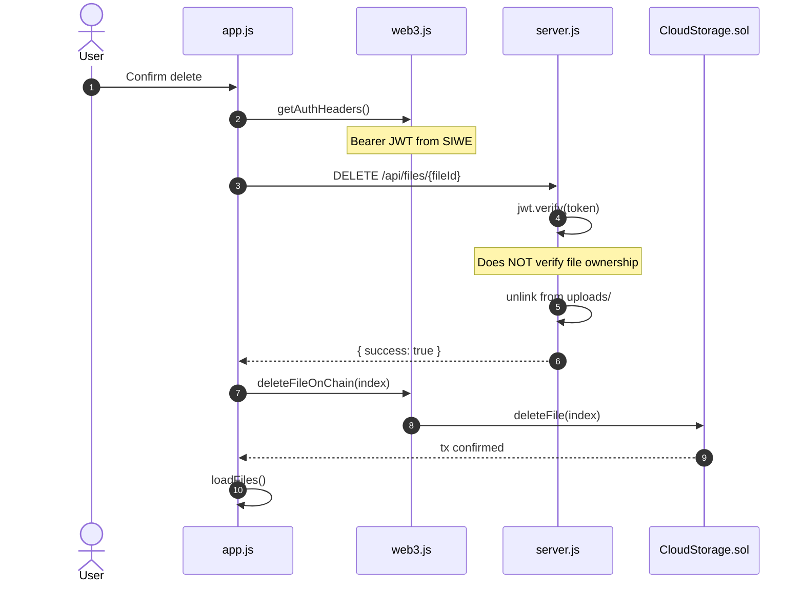

### 4.5 Authentication Sequence

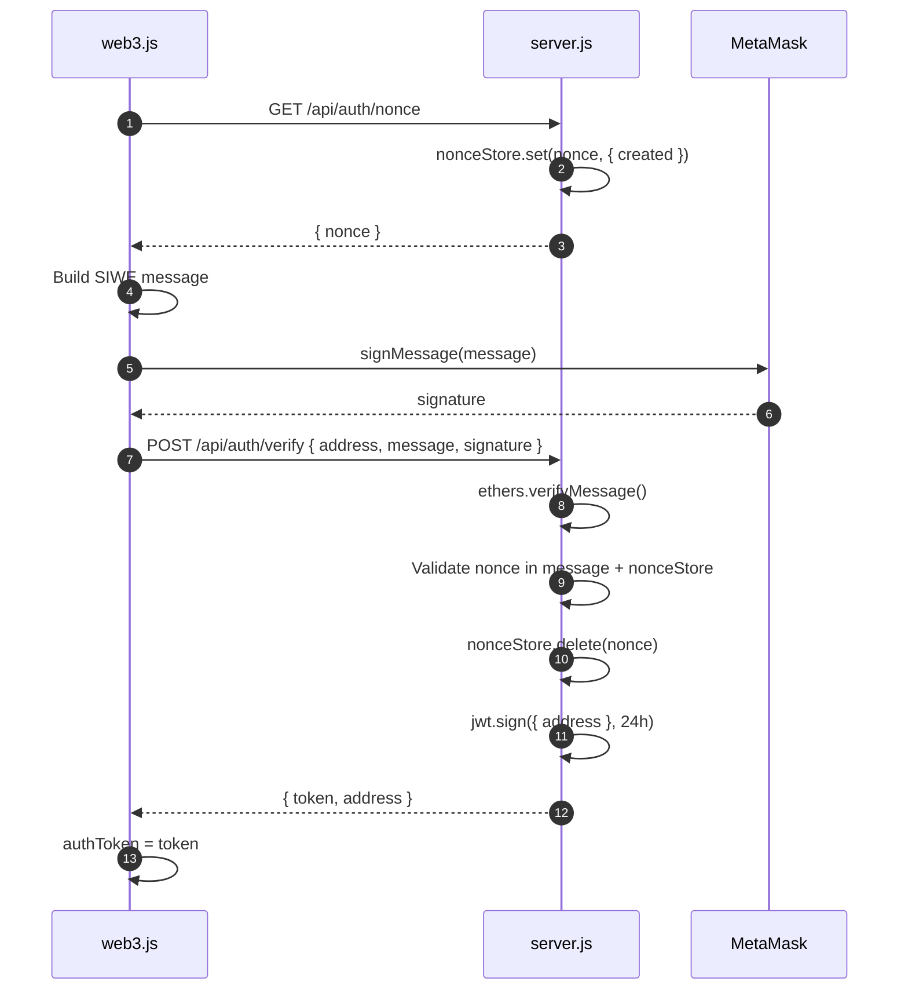

---

## 5. Authentication Architecture

CLD implements **two parallel identity mechanisms** that serve different purposes:

| Mechanism | Trigger | Credential | Used For |
|-----------|---------|------------|----------|
| **Wallet connection** | Connect Wallet button | EIP-1193 account + ethers signer | Contract reads/writes, encryption key derivation |
| **SIWE + JWT** | Automatic after wallet connect | Bearer token (24h TTL) | `DELETE /api/files/:fileId` only |

### Why Two Mechanisms Exist

Wallet connection establishes **on-chain identity** — the smart contract scopes all operations to `msg.sender`. However, HTTP endpoints cannot natively validate MetaMask sessions. SIWE produces a server-verifiable proof that the requester controls a specific address, which is then exchanged for a JWT usable in standard `Authorization` headers.

### SIWE Message Format

The signed message is a fixed multi-line string:

```
Sign in to CLD Cloud Storage

This request will not trigger a blockchain transaction.

Wallet: {userAddress}
Nonce: {nonce}
Issued At: {ISO8601 timestamp}
```

The server extracts the nonce via regex `/Nonce: ([a-f0-9]+)/` and validates one-time use against the in-memory `nonceStore`.

### JWT Payload

```json
{ "address": "<lowercase hex address>", "exp": "<24h from issuance>" }
```

Decoded in `requireAuth` middleware; `req.userAddress` is set for downstream handlers.

### Authentication Boundary Gaps

The authentication architecture does **not** currently form a unified security perimeter:

- Upload requires wallet connection in the UI but the API accepts anonymous uploads.
- Download requires no credentials at any layer.
- Delete requires JWT but does not correlate JWT address with on-chain `File.owner` or prove the requester uploaded the blob.

---

## 6. Storage Architecture

CLD maintains **three storage layers** with different guarantees:

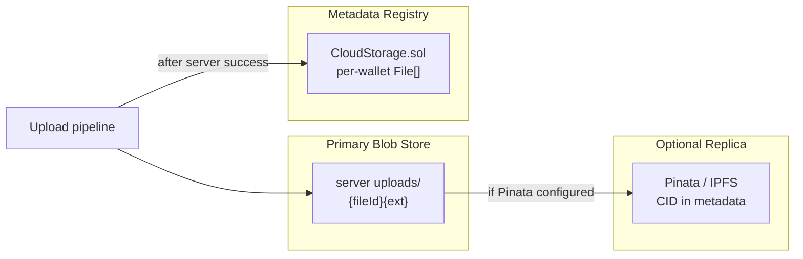

### 6.1 Server Disk Storage

**Location:** `{projectRoot}/uploads/`

**Naming convention:** `{sha256_hex}{sanitized_extension}`

- The SHA-256 is computed over the **stored bytes** (encrypted ciphertext if encryption was enabled at upload).
- Extension is derived from `path.extname(originalname)`, lowercased, stripped to `[a-z0-9.]`.
- Upload uses a temp filename (`temp_{timestamp}_{random}`) then atomic rename.

**Lookup:** Files are found by scanning the directory for entries where `filename.startsWith(fileId)`. This supports extension suffixes without storing a separate index.

**Why content-addressed naming exists:** Dedupes identical content automatically (same hash → same path). The `fileId` on-chain matches the disk lookup key. No database is required for blob indexing.

### 6.2 IPFS Storage (Optional)

**Trigger:** Both `PINATA_API_KEY` and `PINATA_SECRET_KEY` must be set.

**Behavior:** After disk write, `pinToIPFS` streams the file to `https://api.pinata.cloud/pinning/pinFileToIPFS`. The returned `IpfsHash` is included in the upload API response and stored on-chain.

**Failure mode:** Pin errors are logged; upload succeeds with `ipfsHash: ''`.

**Sharing:** The UI copies `https://gateway.pinata.cloud/ipfs/{ipfsHash}` when an IPFS hash exists; otherwise it copies the server download URL.

### 6.3 On-Chain Metadata Storage

**Scope:** Per `address`, an unbounded dynamic array of `File` structs.

**Index semantics:** Array indices are used for delete and rename operations. Delete uses swap-and-pop to avoid shifting gas costs. **Indices are not stable** after deletions — the frontend re-fetches and re-assigns indices on each `getMyFiles()` call.

**Rename scope:** On-chain only. The server blob path is keyed by `fileId` (content hash), not display name. Renaming does not affect disk or IPFS paths.

### 6.4 Metadata vs Content Consistency

There is **no distributed transaction** linking server upload and chain registration:

| Failure Mode | Result |
|--------------|--------|
| Server upload succeeds, chain tx fails | Orphan blob on disk; not in user's catalog |
| Chain tx succeeds, server upload fails | Should not occur (client order: server first) |
| Server delete succeeds, chain tx fails | Blob gone; metadata remains on-chain |
| Chain delete succeeds, server delete fails | Metadata gone; blob remains on disk |

The client implements server-then-chain ordering for delete and upload, but provides no compensating rollback.

---

## 7. Encryption Architecture

### 7.1 Design Intent

Provide confidentiality against the storage operator (Express server, IPFS gateways) without introducing a separate key management service. The wallet is the root of trust for encryption keys.

### 7.2 Key Derivation Flow

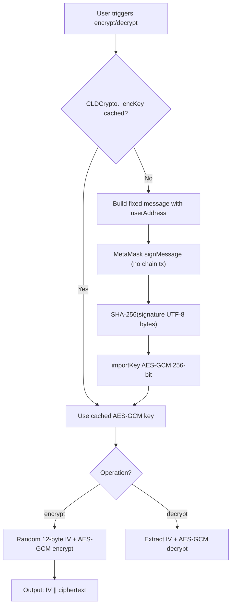

### 7.3 On-Wire / On-Disk Format

```
┌────────────────┬──────────────────────────────┐
│  IV (12 bytes) │  AES-GCM ciphertext + tag    │
└────────────────┴──────────────────────────────┘
```

- Algorithm: **AES-256-GCM** via `crypto.subtle`
- IV: 12 random bytes per file (prepended, not authenticated separately beyond GCM)
- Upload filename: `{originalName}.enc` in multipart (display name on-chain remains original)

### 7.4 Encryption and the Rest of the System

| Component | Awareness of Encryption |
|-----------|-------------------------|
| Server | Stores opaque bytes; no `isEncrypted` field in API |
| Smart contract | Stores `isEncrypted` bool in metadata |
| IPFS | Pins ciphertext if encryption enabled |
| UI | Shows lock badge; branches preview/download logic |

### 7.5 Encryption Key vs SIWE Key

These are **independent signatures** over **different messages**:

| Signature Purpose | Message Prefix | When Requested |
|-------------------|----------------|----------------|
| SIWE login | `Sign in to CLD Cloud Storage` | Wallet connect |
| Encryption key | `CLD Cloud Storage Encryption Key` | First encrypt/decrypt in session |

A user may authenticate via SIWE without ever deriving an encryption key, and vice versa the encryption key derivation does not produce a JWT.

---

## 8. Smart Contract Architecture

### 8.1 Contract as Metadata Registry

The `CloudStorage` contract is intentionally minimal. It does not:

- Store file content
- Verify that `fileId` matches content at an IPFS hash
- Enforce uniqueness of `fileId` per user or globally
- Implement sharing, permissions, or delegation
- Interact with external contracts or oracles

### 8.2 Access Control Model

All state-mutating functions implicitly authorize via `msg.sender`:

- `uploadFile` sets `owner: msg.sender`
- `getMyFiles`, `getFile`, `getFileCount`, `deleteFile`, `renameFile` operate on `userFiles[msg.sender]`

There is no admin role, pause mechanism, or upgrade proxy.

### 8.3 Event-Driven Activity Log

The frontend reconstructs user activity by querying filtered events:

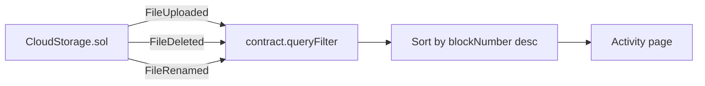

For `FileDeleted` and `FileRenamed`, timestamps are resolved by fetching block headers (`provider.getBlock`). `FileUploaded` uses the `uploadTime` argument from the event.

**Constraint:** `queryFilter` requires the connected node to retain historical logs. Hardhat's in-memory chain satisfies this locally; a fresh node restart loses history.

### 8.4 Gas and Storage Considerations

Solidity `string` fields in storage are expensive. For a local demo this is acceptable. Each `uploadFile` writes six string/uint/bool fields plus array length update. This architecture would not scale to large catalogs on mainnet without redesign (e.g., events-only pattern, IPFS manifest hashes, L2 storage).

---

## 9. Frontend Architecture

### 9.1 Page Model

The SPA implements client-side routing via `data-page` attributes on nav items. Four pages exist:

| Page | ID | Implementation Status |
|------|----|-----------------------|
| Home | `page-home` | Upload zone, stats, recent 5 files |
| My Files | `page-files` | Full list with category tabs |
| Activity | `page-activity` | Blockchain event timeline |
| Shared | `page-shared` | **Static placeholder only** |

`switchPage()` toggles visibility with `display: none/block` and triggers lazy loads (`loadActivity()` on Activity page).

### 9.2 State Management

State is held in module-level variables and DOM — no centralized store:

| State | Location | Scope |
|-------|----------|-------|
| `allFiles` | `app.js` closure | Cached chain metadata |
| `userAddress`, `authToken`, `contract` | `web3.js` module globals | Wallet/session |
| `CLDCrypto._encKey` | `crypto.js` | Encryption session |
| `currentPage`, `currentCategory` | `app.js` closure | UI routing |

Wallet chain/account changes trigger full page reload via `setupWalletListeners`.

### 9.3 File Action Architecture

File row actions use inline `onclick` handlers calling global functions defined at the bottom of `app.js`:

- `viewFileAction(fileId, fileName, isEncrypted)`
- `downloadFileAction(...)`
- `renameFileAction(index, currentName)` — chain only
- `shareFileAction(fileId, ipfsHash)` — clipboard
- `deleteFileAction(index, fileId)` — server then chain

Dropdown menus use kebab buttons with click-outside-to-close behavior.

### 9.4 Preview Pipeline

Preview supports type branching by file extension:

| Type | Plaintext | Encrypted |
|------|-----------|-----------|
| Images | Direct URL | Decrypt → blob URL |
| PDF | iframe | Decrypt → download fallback |
| Video/audio | media elements | Decrypt → download fallback |
| Text/code | fetch + pre | decrypt → TextDecoder → pre |
| Other | Download link | Decrypt → download link |

Text previews truncate at 50,000 characters.

### 9.5 Responsive Behavior

- **Desktop:** Drag-and-drop upload zone, full-screen drag overlay
- **Mobile (≤768px):** Hamburger sidebar, FAB upload button, tap-to-upload (no drag events registered)

---

## 10. Deployment Topology

### 10.1 Required Processes

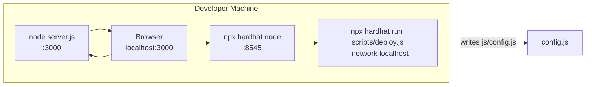

### 10.2 Startup Order

1. Start Hardhat node (`npm run node`)
2. Deploy contract (`npm run deploy`) — regenerates `js/config.js`
3. Configure `.env` (optional: `JWT_SECRET`, Pinata keys)
4. Start Express server (`npm run dev` or `npm start`)
5. Open browser, connect MetaMask to Hardhat Local (chain 31337)

### 10.3 Artifact Pipeline

```
CloudStorage.sol
    → hardhat compile
    → artifacts/contracts/CloudStorage.sol/CloudStorage.json
    → deploy.js extracts ABI + address
    → js/config.js
```

The committed `config.js` contains address `0x5FbDB2315678afecb367f032d93F642f64180aa3` (Hardhat's deterministic first contract address). This is valid only when the contract is the first deployment on a fresh Hardhat node.

### 10.4 Static Asset Serving

Express serves the entire project root as static files, including `uploads/`, `js/`, and `contracts/`. `dotfiles: 'deny'` prevents serving `.env`. There is no separate CDN or asset pipeline.

---

## 11. Advantages and Limitations

### 11.1 Advantages

| Advantage | Architectural Basis |
|-----------|---------------------|
| **Low operational complexity** | No database, no build step, no container orchestration required for local demo |
| **Clear separation of concerns** | Four JS modules + one server file + one contract; each has a bounded responsibility |
| **Client-side encryption option** | Server and IPFS operators cannot read encrypted content without wallet key |
| **Content-addressed blobs** | SHA-256 naming enables deduplication and integrity verification by hash |
| **Wallet-scoped ownership narrative** | On-chain catalog tied to address with auditable event history |
| **Optional decentralized replication** | IPFS pinning adds redundancy and gateway-based sharing without architectural rework |
| **Fast local iteration** | Hardhat instant mining, auto-generated config, single-machine topology |
| **Progressive enhancement** | IPFS and encryption are optional; core upload/download works without them |

### 11.2 Limitations

| Limitation | Impact |
|------------|--------|
| **Split-brain security model** | On-chain ownership does not gate blob access |
| **No transactional upload** | Server and chain can diverge on partial failure |
| **Localhost-only chain config** | No tested path to testnet/mainnet |
| **In-memory nonce store** | SIWE state lost on server restart; not multi-instance safe |
| **Ephemeral JWT secret default** | Sessions invalidated on every server restart if `JWT_SECRET` unset |
| **Index-based delete/rename** | Fragile if UI stale; indices shift after deletes |
| **No automated tests** | Contract and API behavior unverified by CI |
| **Synchronous IPFS pin** | Upload latency tied to Pinata response time |
| **Shared page unimplemented** | UI suggests feature that does not exist |
| **Global JS scope** | Action handlers and module state lack encapsulation |
| **Encryption key portability unverified** | Depends on deterministic wallet signatures |

---

## 12. Current Architectural Constraints

These are hard limits of the **current implementation**, not theoretical ideals.

### 12.1 Security Constraints

1. **`GET /api/files/:fileId` is public.** Knowledge of the 64-character hex hash is sufficient to download any blob.
2. **`POST /api/upload` is public.** No rate-limit identity beyond IP; upload limit is 30 per 15 minutes per IP.
3. **JWT does not authorize ownership.** Any SIWE-authenticated wallet can delete any `fileId` on disk.
4. **No server-side owner registry.** The server cannot validate that a JWT address owns a file.
5. **CORS restricted to localhost.** Production deployment on another origin requires code change.
6. **Helmet CSP disabled.** `contentSecurityPolicy: false` reduces XSS mitigation.
7. **Encrypted IPFS links leak ciphertext.** Sharing an IPFS URL shares encrypted bytes, not plaintext.

### 12.2 Operational Constraints

1. **Hardhat node must be running** before browser contract interaction; server logs explicitly warn about `:8545`.
2. **Contract redeploy invalidates** prior on-chain data unless using a persistent Hardhat fork/archive.
3. **`uploads/` is the sole blob store.** No backup, replication, or cleanup of orphan files.
4. **100 MB upload limit** enforced by Multer; 1 MB JSON body limit for auth endpoints.
5. **Blocked executable extensions** only; no MIME validation or virus scanning.
6. **Single-server assumption.** No load balancer, sticky sessions, or shared filesystem.

### 12.3 Data Model Constraints

1. **`fileName` is not unique** per user; duplicates allowed on-chain.
2. **`fileId` is not unique** per user; same content uploaded twice creates duplicate entries.
3. **Rename is metadata-only** and does not propagate to IPFS pinned name or disk path.
4. **`fileSize` on-chain** reflects uploaded blob size (encrypted size when encryption enabled).
5. **Activity log requires event history** on the connected RPC node.

### 12.4 Configuration Constraints

1. **`js/config.js` must match deployed contract.** Manual edits break the frontend.
2. **`NETWORK.currency` vs `NETWORK.nativeCurrency` mismatch** affects MetaMask chain-add display.
3. **`.env` is not in `.gitignore`.** Risk of secret commit (verified: `.gitignore` contains only `node_modules`).

---

## 13. Scalability Considerations

### 13.1 Horizontal Scaling — Current Blockers

| Component | Blocker |
|-----------|---------|
| Blob storage | Local `uploads/` directory is not shared across instances |
| SIWE nonces | In-memory `Map` is not shared; breaks with multiple server replicas |
| JWT | Stateless — scales if `JWT_SECRET` is consistent across instances |
| Hardhat node | Single-process local chain; not a production network |
| Contract `getMyFiles` | Returns entire array; O(n) RPC payload growth |

### 13.2 Vertical Scaling Limits

- Disk I/O and capacity on the server host
- Multer buffers entire file to compute hash (`fs.readFileSync`) — memory pressure on large files near 100 MB limit
- Directory scan for file lookup (`fs.readdirSync`) — O(n) in number of stored files

### 13.3 Blockchain Scaling

- Each file adds ~6 storage slots of string/uint data plus array element — impractical for large catalogs on L1
- Event `queryFilter` from genesis slows as chain history grows
- No pagination API on contract; frontend loads all files always

### 13.4 IPFS Scaling

- Pinata API rate limits and costs apply at scale
- Synchronous pin blocks upload response; high concurrency would require async job queue

### 13.5 Scaling Path Summary

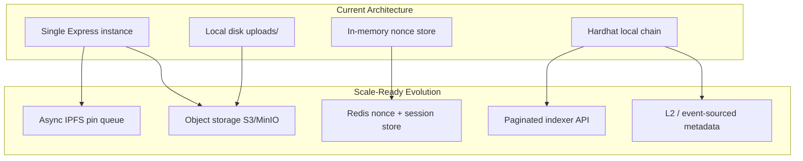

---

## 14. Future Evolution Possibilities

These are architectural directions compatible with the current codebase. **None are implemented.**

### 14.1 Unified Access Control Layer

Introduce a server-side `fileId → ownerAddress` registry (database or object metadata). Require JWT on upload/download/delete and verify JWT address matches registered owner or on-chain `File.owner`. This would align blob access with wallet identity.

### 14.2 Two-Phase Commit / Saga for Upload

Implement compensating actions: if chain registration fails after server upload, delete the orphan blob (or mark as pending for retry). A `PENDING` state in metadata could reconcile drift.

### 14.3 Replace Index-Based Mutations

Use `fileId` as the on-chain primary key instead of array index for delete/rename. Alternatively, emit events only and index off-chain via a subgraph or custom indexer.

### 14.4 Implement Shared Files Page

Model sharing explicitly: either encrypt file with recipient public key, or store server-side ACL with signed access tokens, or use on-chain permission mapping (`fileId → allowed addresses`).

### 14.5 Production Network Support

Extend `hardhat.config.js` with Sepolia/Base/etc., environment-driven `config.js` generation (not hardcoded localhost URL), and block explorer links in activity UI.

### 14.6 Async IPFS Pipeline

Decouple pinning into a background worker (Bull/BullMQ, SQS). Return upload immediately; update on-chain `ipfsHash` in a second transaction or via server-push to client.

### 14.7 Proper Key Management

Replace signature-derived keys with explicit key export/import, Shamir sharing, or integration with wallet encryption standards. Document and test cross-device recovery.

### 14.8 Build Tooling and Testing

Introduce Hardhat tests for contract invariants, API integration tests for upload/auth flows, and a bundler (Vite/esbuild) for modular frontend code with environment injection.

### 14.9 Content Delivery

Serve blobs from CDN with signed URLs (short TTL, bound to JWT). Keep `fileId` as cache key. Encrypted content remains safe at CDN edge.

### 14.10 Event-Only On-Chain Pattern

Store only a Merkle root or manifest CID on-chain; full file list lives on IPFS/Arweave. Reduces gas for users with large libraries.

---

## Appendix A: File Reference Map

| Path | Architectural Role |
|------|-------------------|
| `contracts/CloudStorage.sol` | On-chain metadata registry |
| `server.js` | HTTP API, blob store, auth, IPFS |
| `js/config.js` | Generated runtime configuration |
| `js/web3.js` | Wallet, SIWE, contract interaction |
| `js/crypto.js` | Client-side AES-256-GCM |
| `js/app.js` | UI orchestration |
| `index.html` | SPA structure |
| `style.css` | Presentation layer |
| `scripts/deploy.js` | Deploy + config generation |
| `hardhat.config.js` | Compile and network config |
| `uploads/` | Content-addressed blob directory |

## Appendix B: External Dependencies

| Dependency | Role in Architecture |
|------------|---------------------|
| MetaMask | EIP-1193 provider, transaction signing |
| ethers.js v6.9.0 | Browser: CDN; Server: signature verification in auth |
| Pinata | IPFS pinning gateway |
| Hardhat | Local EVM, compilation, deployment |
| Express ecosystem | HTTP server, upload parsing, security middleware |

---

*Document version: 1.0 — reflects implementation as analyzed from repository source code.*
