# CLD Backend — Implementation Reference

This document describes the **Express backend** implemented in `server.js`. It is written for backend engineers who need to maintain, debug, or extend blob storage, authentication, and HTTP API behavior.

The backend is a **single-process Node.js application** with no database, no job queue, and no separate service layers. All server logic lives in one file (~290 lines). The smart contract handles metadata only; this server is the **sole authority for file bytes**.

---

## Table of Contents

1. [Backend Overview](#1-backend-overview)
2. [Server Architecture](#2-server-architecture)
3. [Directory Responsibilities](#3-directory-responsibilities)
4. [Request Lifecycle](#4-request-lifecycle)
5. [Upload Pipeline](#5-upload-pipeline)
6. [Download Pipeline](#6-download-pipeline)
7. [Delete Pipeline](#7-delete-pipeline)
8. [Authentication Backend](#8-authentication-backend)
9. [Environment Variables](#9-environment-variables)
10. [Security](#10-security)
11. [Error Handling](#11-error-handling)
12. [Performance](#12-performance)
13. [Current Limitations](#13-current-limitations)
14. [Future Improvements](#14-future-improvements)
15. [Backend File Reference](#15-backend-file-reference)

---

## 1. Backend Overview

### Role in the System

The backend occupies the **application and blob storage tier**. It exposes a REST API over HTTP, persists uploaded files to local disk, optionally pins those files to IPFS via Pinata, and implements Sign-In With Ethereum (SIWE) authentication that produces JWTs for protected operations.

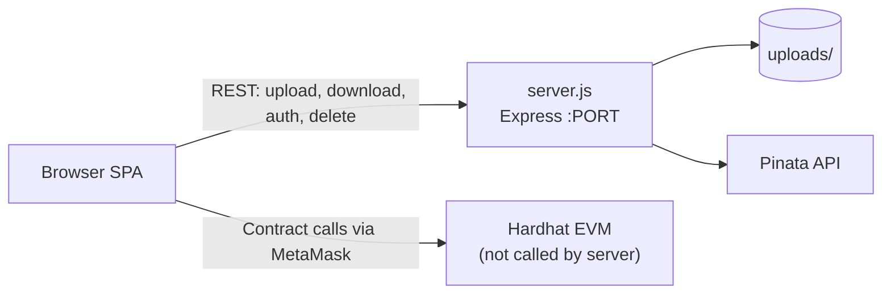

The server **never** communicates with the blockchain directly. Chain registration is performed entirely by the browser after a successful upload response. The backend's responsibility ends at returning `{ fileId, ipfsHash, fileName, fileSize }`.

### Why the Backend Exists Despite Blockchain Usage

The blockchain in this project stores **metadata only** — hash identifier, display name, size, timestamp, optional IPFS CID, encryption flag, and owner address. It cannot:

| Capability | Why blockchain cannot provide it | Backend provides it |
|------------|----------------------------------|---------------------|
| Store multi-MB file bytes | Prohibitively expensive on EVM | `uploads/` disk storage |
| Stream downloads to browsers | No blob delivery layer on-chain | `GET /api/files/:fileId` |
| Hold Pinata API secrets | Secrets cannot live on-chain | `PINATA_*` env vars in `server.js` |
| Issue HTTP session tokens | JWT requires trusted issuer | SIWE verify + `jsonwebtoken` |
| Accept multipart uploads | Wallets do not upload files | Multer disk pipeline |

Without the backend, users would have metadata on-chain with no way to store or retrieve actual file content through the application.

### Entry Point and Runtime

| Property | Value |
|----------|-------|
| Entry file | `server.js` |
| npm scripts | `npm run dev` / `npm start` → `node server.js` |
| Default port | `3000` |
| Process model | Single Node.js process, no clustering |
| Static hosting | Same process serves the SPA from project root |

---

## 2. Server Architecture

All server code is contained in `server.js`. There are no routers, controllers, services, or middleware files — everything is registered inline at module load time.

### Express Initialization

```javascript
require('dotenv').config();
const app = express();
const PORT = process.env.PORT || 3000;
```

**Purpose:** Load environment variables before any configuration reads them, then create a single Express application instance.

**Why it exists:** `dotenv` must run first so `JWT_SECRET`, `PINATA_*`, and `PORT` are available when constants are initialized on lines 15–17.

**Dependencies loaded at startup:**

| Module | Usage |
|--------|-------|
| `express` | HTTP server and routing |
| `multer` | Multipart upload parsing |
| `cors` | Cross-origin policy |
| `crypto` (Node built-in) | Nonce generation, SHA-256, random JWT secret |
| `path`, `fs` (Node built-in) | Filesystem operations |
| `helmet` | HTTP security headers |
| `express-rate-limit` | Request throttling |
| `jsonwebtoken` | JWT sign/verify |
| `form-data` | Pinata multipart upload |
| `ethers` | **Lazy-loaded** inside `POST /api/auth/verify` only |

### Middleware Order

Middleware and route handlers are registered in this exact order. Order matters because Express executes matching middleware sequentially.

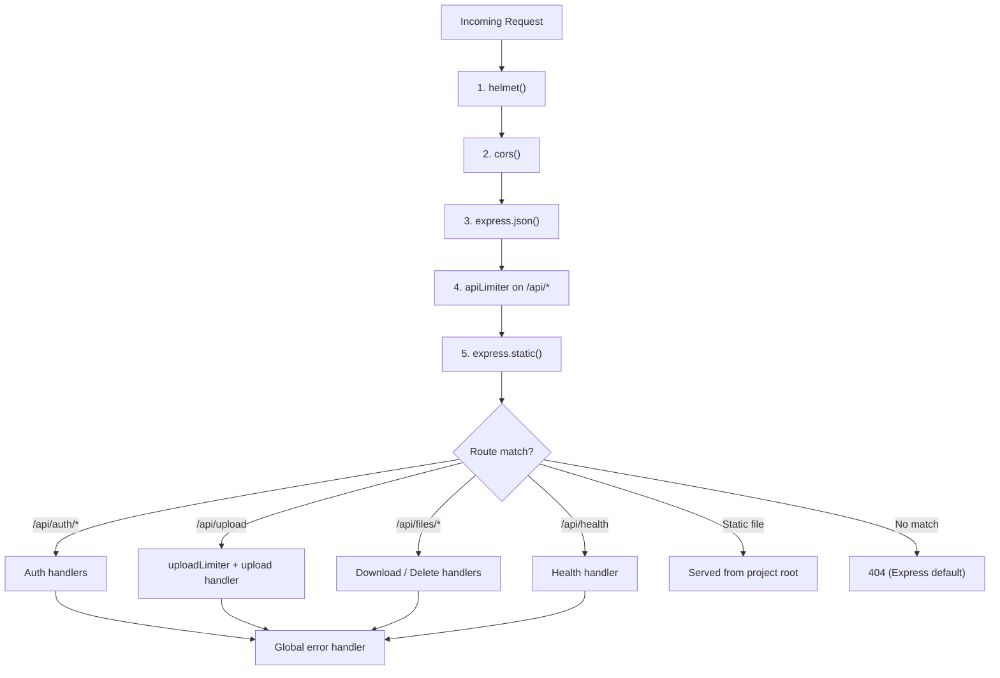

| Order | Middleware | Scope | Purpose |
|-------|------------|-------|---------|
| 1 | `helmet({ contentSecurityPolicy: false, crossOriginEmbedderPolicy: false })` | All requests | Sets security-related HTTP headers; CSP and COEP explicitly disabled |
| 2 | `cors({ origin: [...], methods: [...], maxAge: 86400 })` | All requests | Allows browser from localhost origins only |
| 3 | `express.json({ limit: '1mb' })` | All requests | Parses JSON bodies for auth verify endpoint |
| 4 | `apiLimiter` | `/api/*` | 100 requests per 15 minutes per IP |
| 5 | `express.static(__dirname, { index: 'index.html', dotfiles: 'deny' })` | All requests | Serves SPA, JS, CSS, and other project files |
| — | Route handlers | Per path | Business logic |
| Last | 4-arg error handler | Errors passed to `next(err)` | Returns generic 500 JSON |

**Important:** `express.static` is registered **before** API route handlers in source code, but Express matches routes in registration order. Static middleware runs for every request; if no static file matches, execution falls through to route handlers registered later. API routes (`app.get`, `app.post`, etc.) are registered after static middleware and take precedence when paths match exactly.

**Additional per-route middleware:**

| Route | Extra middleware |
|-------|------------------|
| `POST /api/upload` | `uploadLimiter` (30 uploads / 15 min / IP) |
| `DELETE /api/files/:fileId` | `requireAuth` |

### Static Hosting

```javascript
app.use(express.static(__dirname, { index: 'index.html', dotfiles: 'deny' }));
```

**Purpose:** Serve the frontend SPA and all project-root assets from the same origin as the API.

**Why it exists:** Eliminates CORS complexity for same-origin deployment during local development. The browser loads `index.html`, `js/*`, `style.css`, and `logo CLD.svg` from the same host as `/api/*`.

**Behavior:**
- `GET /` → serves `index.html`
- `GET /js/app.js` → serves file from disk
- `dotfiles: 'deny'` → blocks `.env`, `.gitignore`, etc. from being served
- **`uploads/` is also served statically** if requested by direct path (e.g. `GET /uploads/{hash}.png`). The intended download path is `/api/files/:fileId`, but static middleware exposes the uploads directory unless blocked by other means. This is an implementation side effect, not a documented API.

### Route Registration

Routes are registered as plain `app.get/post/delete` calls — no `express.Router()`.

| Method | Path | Middleware | Handler location |
|--------|------|------------|------------------|
| `GET` | `/api/auth/nonce` | apiLimiter | Lines 67–71 |
| `POST` | `/api/auth/verify` | apiLimiter, express.json | Lines 73–104 |
| `POST` | `/api/upload` | apiLimiter, uploadLimiter, multer | Lines 167–212 |
| `GET` | `/api/files/:fileId` | apiLimiter | Lines 215–234 |
| `DELETE` | `/api/files/:fileId` | apiLimiter, requireAuth | Lines 237–258 |
| `GET` | `/api/health` | apiLimiter | Lines 261–268 |

### Configuration Loading

Configuration is read once at module initialization and stored in module-level constants:

```javascript
const PORT = process.env.PORT || 3000;
const JWT_SECRET = process.env.JWT_SECRET || crypto.randomBytes(32).toString('hex');
const PINATA_API_KEY = process.env.PINATA_API_KEY;
const PINATA_SECRET_KEY = process.env.PINATA_SECRET_KEY;
const UPLOADS_DIR = path.join(__dirname, 'uploads');
```

There is no config file loader, no schema validation, and no hot reload. Changing `.env` requires a process restart.

### Startup Side Effects

On module load, before `app.listen`:

1. **`uploads/` directory** — created if missing (`fs.mkdirSync` with `{ recursive: true }`)
2. **Nonce cleanup interval** — `setInterval` every 10 minutes removes nonces older than 10 minutes from `nonceStore`

### Request Lifecycle Diagram (Server-Level)

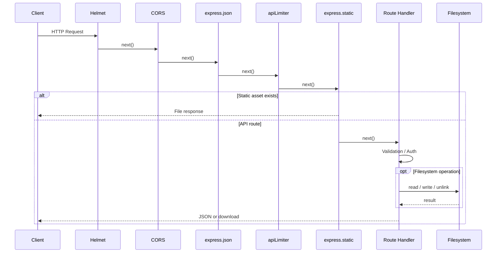

---

## 3. Directory Responsibilities

The backend interacts with filesystem paths under the project root. There is no dedicated `tmp/` directory — temporary upload files land directly in `uploads/`.

### `uploads/`

| Property | Detail |
|----------|--------|
| **Path** | `{projectRoot}/uploads/` via `path.join(__dirname, 'uploads')` |
| **Created by** | Server on startup if missing |
| **Purpose** | Permanent content-addressed blob storage |

**File naming after upload completes:**

```
{sha256_hex_64_chars}{sanitized_extension}
```

Example: `0c49df6c4e613e390fef5ae88da5fa5b3494e633a37659320e9987f68017a409.pdf`

**Temporary files during upload:**

```
temp_{Date.now()}_{8_byte_random_hex}
```

Example: `temp_1719980000000_a1b2c3d4e5f6g7h8`

Temporary files exist only between Multer write and successful `fs.renameSync`. On upload failure, the catch block attempts `fs.unlinkSync(req.file.path)`.

**Lookup strategy:** Both download and delete scan the entire directory with `fs.readdirSync(UPLOADS_DIR)` and find the first filename where `f.startsWith(fileId)`. The extension suffix is not part of the lookup key.

**Not managed by the server:**
- Orphan cleanup (blob exists, no chain entry)
- Quotas per user
- Subdirectories or sharding

### Temporary Upload Files

Temporary files are not stored in a separate directory. Multer's `diskStorage` writes directly to `UPLOADS_DIR` with a `temp_` prefix.

**Lifecycle:**

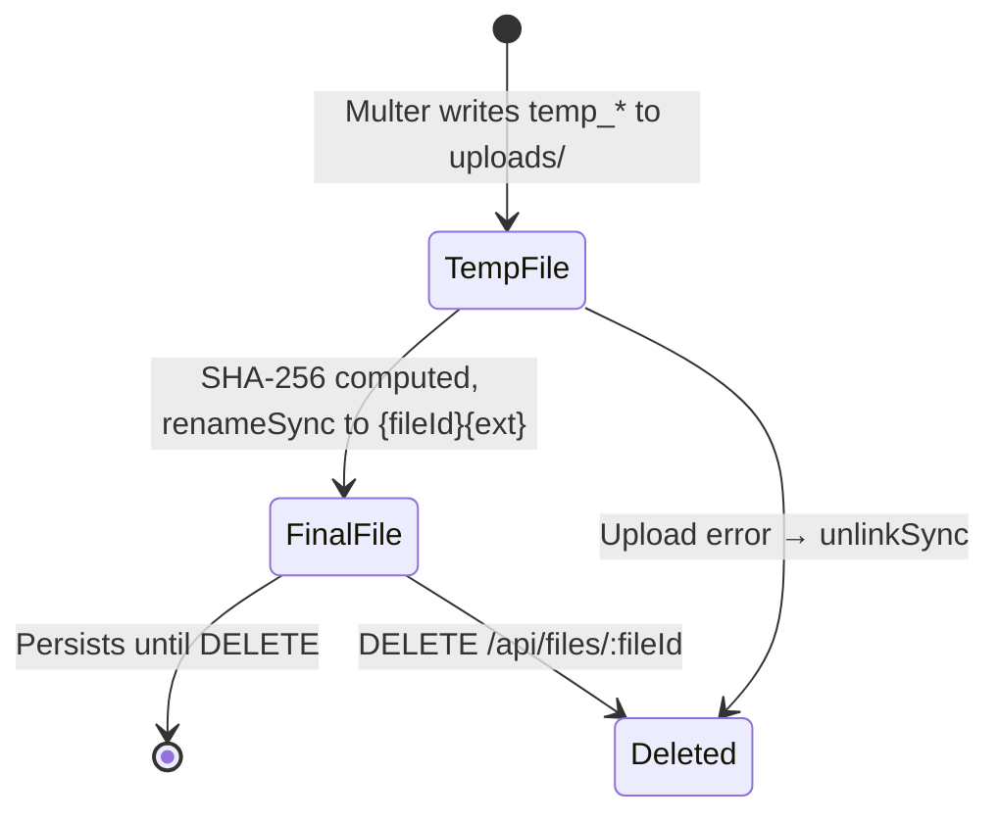

### Generated Files

The backend does **not** generate files outside `uploads/`. It does not write logs to disk, cache files, or export reports.

Files in `uploads/` are **user-uploaded content**, not server-generated artifacts. The SHA-256 hash is derived from uploaded bytes but the file itself originates from the client.

### Configuration

| Source | Read by | Contents |
|--------|---------|----------|
| `.env` | `dotenv` at line 1 | `PORT`, `JWT_SECRET`, `PINATA_API_KEY`, `PINATA_SECRET_KEY` |
| Environment variables | Same constants | Override `.env` values per Node convention |
| `package.json` | npm only | Scripts and dependency versions; not read by `server.js` |

The backend does not read `js/config.js`. Contract address and chain configuration are frontend-only.

### Runtime State

All mutable server state lives **in process memory**:

| State | Type | Purpose | Persistence |
|-------|------|---------|-------------|
| `nonceStore` | `Map<string, { created: number }>` | SIWE one-time nonces | Lost on restart |
| `JWT_SECRET` | `string` | Token signing key | Random per restart if env unset |
| `app` | Express instance | Route registry | N/A |

There is no Redis, no session store, and no database connection pool.

---

## 4. Request Lifecycle

This section traces the exact execution path for each request category.

### 4.1 Unauthenticated GET (Download / Health / Nonce)

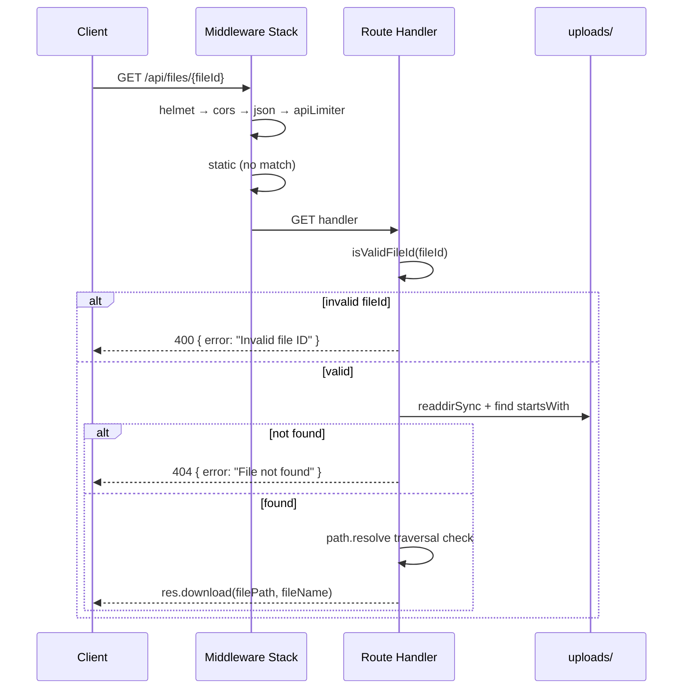

**Authentication:** None. No `requireAuth` on download.

### 4.2 Authenticated DELETE

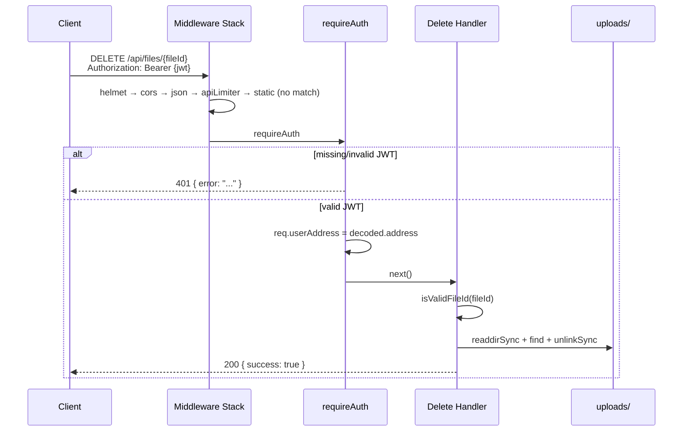

### 4.3 Multipart POST (Upload)

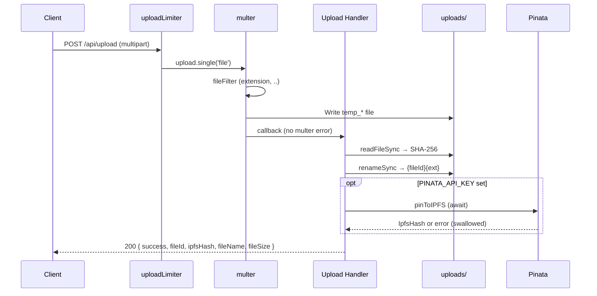

### 4.4 JSON POST (Auth Verify)

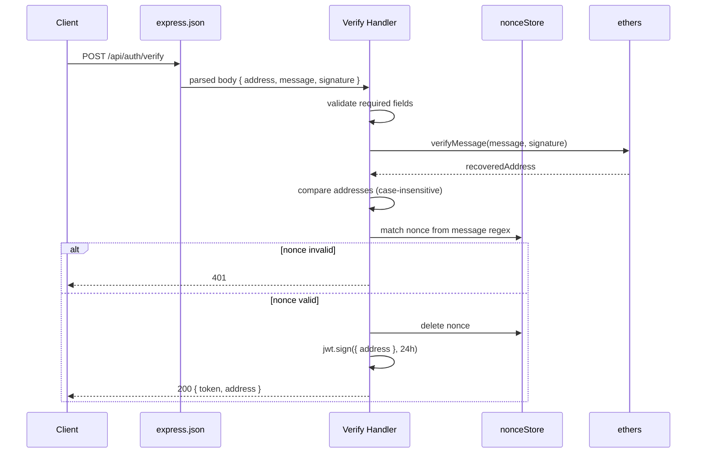

### Middleware → Auth → Business Logic → Filesystem → Response

| Stage | Upload | Download | Delete | Auth |
|-------|--------|----------|--------|------|
| **Middleware** | helmet, cors, json, apiLimiter, uploadLimiter | helmet, cors, json, apiLimiter | helmet, cors, json, apiLimiter | helmet, cors, json, apiLimiter |
| **Authentication** | None | None | `requireAuth` (JWT) | Signature verification (not JWT) |
| **Business logic** | Hash, rename, optional IPFS | Lookup by prefix | Lookup + unlink | Nonce check, JWT issue |
| **Filesystem** | write temp, read, rename | readdir, send file | readdir, unlink | None |
| **Response** | JSON metadata | File stream via `res.download` | JSON `{ success: true }` | JSON `{ token, address }` |

---

## 5. Upload Pipeline

**Endpoint:** `POST /api/upload`  
**Field name:** `file` (Multer `upload.single('file')`)  
**Authentication:** None

### Step-by-Step Internal Workflow

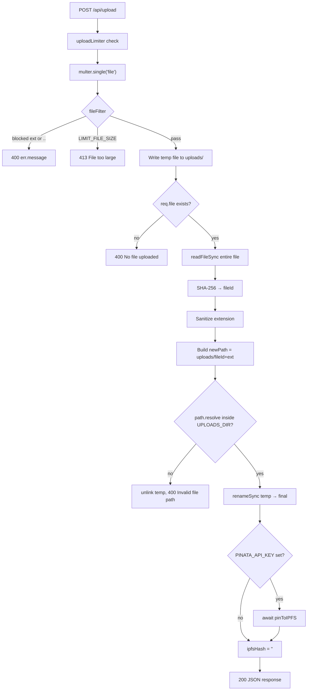

### Multipart Upload

The client sends `Content-Type: multipart/form-data` with a single field named `file`. Multer parses the stream and invokes `diskStorage` callbacks.

**Why multipart:** Standard HTTP mechanism for file uploads. The browser `FormData` API in `js/app.js` appends either the raw `File` or an encrypted `Blob`.

### Multer Configuration

```javascript
const storage = multer.diskStorage({
    destination: (req, file, cb) => cb(null, UPLOADS_DIR),
    filename: (req, file, cb) => cb(null, `temp_${Date.now()}_${crypto.randomBytes(8).toString('hex')}`)
});

const upload = multer({
    storage,
    limits: { fileSize: 100 * 1024 * 1024, files: 1 },
    fileFilter: (req, file, cb) => { /* ... */ }
});
```

| Option | Value | Effect |
|--------|-------|--------|
| `fileSize` limit | 100 MB | Multer rejects with `LIMIT_FILE_SIZE` |
| `files` limit | 1 | Single file per request |
| `destination` | `UPLOADS_DIR` | Temp and final files in same directory |

**Dependencies:** `multer@1.4.5-lts.1`

### Temporary Storage

Multer writes the complete uploaded file to disk before the route handler runs. The handler then reads the entire file back into memory for hashing (see [Performance](#12-performance)).

Temp filename format: `temp_{timestamp}_{16_hex_chars}` — collision risk is negligible.

### SHA-256 Generation

```javascript
const fileBuffer = fs.readFileSync(req.file.path);
const fileId = crypto.createHash('sha256').update(fileBuffer).digest('hex');
```

**Purpose:** Produce a content-addressed identifier returned to the client for chain registration and future downloads.

**Properties:**
- Computed over **stored bytes** (ciphertext if client encrypted before upload)
- 64 lowercase hex characters
- Same content uploaded twice produces the same `fileId` (dedupe by overwrite on rename — see limitation)

### Filename Generation (Final)

```javascript
const ext = path.extname(req.file.originalname).toLowerCase().replace(/[^a-z0-9.]/g, '');
const newPath = path.join(UPLOADS_DIR, fileId + ext);
fs.renameSync(req.file.path, newPath);
```

**Final disk name:** `{fileId}{ext}`

**Original filename** is preserved only in the JSON response (`fileName: req.file.originalname`) and eventually on-chain — not in the disk filename beyond the sanitized extension.

### Extension Sanitization

Two separate checks apply:

| Stage | Check | Action |
|-------|-------|--------|
| **fileFilter** | `path.extname(originalname).toLowerCase()` in `BLOCKED_EXT` | Reject upload |
| **fileFilter** | `originalname.includes('..')` | Reject upload |
| **Post-upload** | `.replace(/[^a-z0-9.]/g, '')` on extension | Strip unsafe characters from stored extension |

**Blocked extensions:** `.exe`, `.bat`, `.cmd`, `.com`, `.msi`, `.scr`, `.pif`, `.vbs`, `.ps1`, `.dll`

**Not validated:** MIME type, magic bytes, double extensions beyond `path.extname` (uses last extension only).

### Disk Persistence

After successful rename, the file persists at `uploads/{fileId}{ext}` until explicitly deleted via `DELETE /api/files/:fileId`.

If a file with the same `fileId` already exists (identical content re-uploaded), `renameSync` overwrites the existing file on POSIX systems. No duplicate detection or versioning exists.

### Optional IPFS Upload

```javascript
let ipfsHash = '';
if (PINATA_API_KEY) {
    ipfsHash = await pinToIPFS(newPath, req.file.originalname);
}
```

**Trigger condition:** Only `PINATA_API_KEY` is checked. `PINATA_SECRET_KEY` is validated inside `pinToIPFS` (both required for actual pin).

**Implementation (`pinToIPFS`):**
1. Return `''` immediately if either Pinata key missing
2. Create `FormData` with `fs.createReadStream(filePath)`
3. POST to `https://api.pinata.cloud/pinning/pinFileToIPFS`
4. Parse JSON response, extract `IpfsHash`
5. On any error: log to stderr, return `''` — **upload still succeeds**

**Note on comment vs behavior:** Source comment on line 191 says "non-blocking for response" but the handler **`await`s** `pinToIPFS` before sending the JSON response. IPFS pinning **blocks** the upload response.

**Dependencies:** `form-data@4.0.5`, Pinata HTTPS API

### JSON Response

```json
{
  "success": true,
  "fileId": "64_char_hex",
  "ipfsHash": "Qm... or empty string",
  "fileName": "original_client_filename",
  "fileSize": 12345
}
```

`fileSize` is `req.file.size` from Multer — the size of the uploaded multipart body (encrypted size if client sent ciphertext).

### Upload Error Handling

| Condition | Status | Body |
|-----------|--------|------|
| Multer `LIMIT_FILE_SIZE` | 413 | `{ error: "File too large (max 100MB)" }` |
| fileFilter rejection | 400 | `{ error: err.message }` |
| No file in request | 400 | `{ error: "No file uploaded" }` |
| Path traversal on rename | 400 | `{ error: "Invalid file path" }` |
| Any other exception | 500 | `{ error: "Upload failed" }` |

Catch block cleans up: `if (req.file && fs.existsSync(req.file.path)) fs.unlinkSync(req.file.path)`

### Upload Security Considerations

- No authentication — any client can upload up to rate limit
- Extension blocklist is not a complete malware defense
- Full file buffered in memory for hashing
- Pinata credentials sent on every pin request via headers

### Upload Limitations

- Single file per request (client loops for batch upload)
- IPFS failure is silent to client (`ipfsHash: ''`)
- No virus scanning or content inspection
- No per-user upload quota
- Duplicate `fileId` overwrites without warning

### Upload Future Improvements

- Stream-hash without full `readFileSync` buffer
- Async IPFS queue decoupled from response
- Require JWT on upload; bind uploads to `req.userAddress`
- Check `PINATA_SECRET_KEY` at startup, not only at pin time
- Separate temp directory outside web-served static root

---

## 6. Download Pipeline

**Endpoint:** `GET /api/files/:fileId`  
**Query parameter:** `name` (optional) — used as download filename  
**Authentication:** None

### Internal Workflow

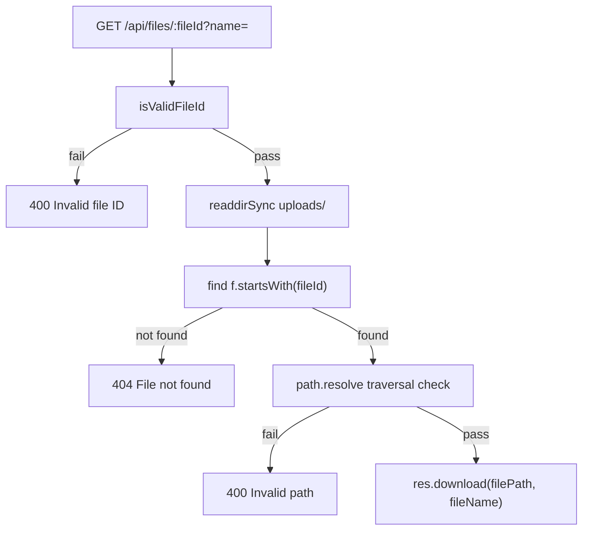

### File Lookup

```javascript
const files = fs.readdirSync(UPLOADS_DIR);
const matched = files.find(f => f.startsWith(fileId));
```

**Algorithm:** Linear scan of entire `uploads/` directory. First match wins.

**Prefix matching implication:** A malicious or accidental `fileId` that is a prefix of another hash could theoretically match the wrong file. In practice, SHA-256 hex strings at full 64-char length make prefix collisions between valid IDs extremely unlikely. Partial `fileId` in URL would match the first file whose name starts with that prefix.

### Path Validation

```javascript
const filePath = path.join(UPLOADS_DIR, matched);
if (!path.resolve(filePath).startsWith(path.resolve(UPLOADS_DIR))) {
    return res.status(400).json({ error: 'Invalid path' });
}
```

**Purpose:** Prevent path traversal if `matched` contained `../` sequences. In normal operation `matched` comes from `readdirSync` and should be a bare filename, but this check is defensive.

### Streaming and Headers

```javascript
res.download(filePath, fileName);
```

**Behavior:** Express `res.download()` sets `Content-Disposition: attachment` with filename from `req.query.name || 'download'` and streams the file from disk.

**Not set explicitly by this code:**
- `Content-Type` (Express infers from extension)
- Cache-Control headers
- Content-Length (handled by Express/send module)
- Range request / partial content support

The server does **not** decrypt files. Encrypted files are stored as ciphertext; decryption happens in the browser via `CLDCrypto.decrypt` after fetch.

### Encrypted Files

The backend has **no awareness** of encryption:

| Aspect | Backend behavior |
|--------|------------------|
| Storage | Opaque bytes, may have `.enc` in client original name |
| `Content-Type` | Not adjusted for encrypted content |
| Download | Raw ciphertext streamed to client |
| Metadata | No `isEncrypted` field in API |

The client uses on-chain `isEncrypted` to decide whether to decrypt after download.

### Download Error Handling

| Condition | Status | Body |
|-----------|--------|------|
| Invalid `fileId` format | 400 | `{ error: "Invalid file ID" }` |
| No matching file | 404 | `{ error: "File not found" }` |
| Path validation failure | 400 | `{ error: "Invalid path" }` |
| Filesystem or stream error | 500 | `{ error: "Download failed" }` |

### Download Security Considerations

- **Public access:** Anyone who knows or guesses the 64-char hash can download
- No rate limit beyond global `/api/` limiter
- No audit logging of downloads
- Static middleware may also serve files under `/uploads/` directly

### Download Limitations

- O(n) directory scan per request
- No signed URLs or time-limited access
- No bandwidth throttling
- First prefix match only — no ambiguity handling

### Download Future Improvements

- Index `fileId → path` in memory or database at startup
- Require JWT; verify ownership against registry
- Support `Content-Disposition: inline` for preview vs attachment
- Disable static serving of `uploads/` directory
- Add ETag / If-None-Match for caching

---

## 7. Delete Pipeline

**Endpoint:** `DELETE /api/files/:fileId`  
**Authentication:** Required — `Authorization: Bearer {jwt}`

### Internal Workflow

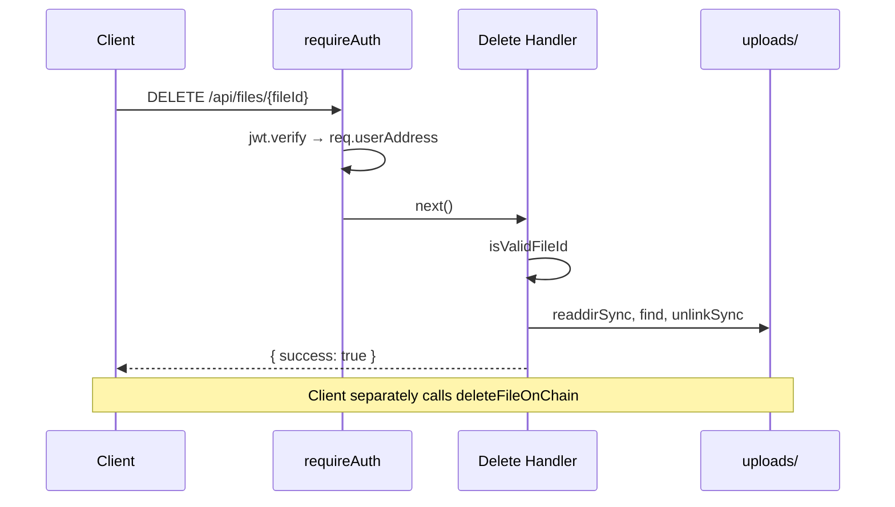

### JWT Validation

Handled by `requireAuth` before the delete handler executes. See [Section 8](#8-authentication-backend).

The delete handler receives `req.userAddress` (lowercase hex) but **does not use it** for authorization decisions beyond logging:

```javascript
console.log(`🗑️ Deleted by ${req.userAddress}: ${fileId}`);
```

### File Lookup

Identical algorithm to download: `readdirSync` + `startsWith(fileId)` + path traversal check.

If file not found: **404** before any delete attempt.

### Ownership Assumptions

**The backend does not enforce file ownership.**

| Check | Performed? |
|-------|------------|
| Valid JWT present | Yes |
| JWT address owns this blob | **No** |
| JWT address matches on-chain `File.owner` | **No** (server has no chain access) |
| JWT address uploaded this file | **No** (no upload ownership registry) |

Any wallet that has completed SIWE and holds a valid JWT can delete **any** `fileId` on disk if they know the hash.

The client orchestrates delete as: server DELETE first, then `deleteFileOnChain(index)`. These are not atomic. Server deletion can succeed while chain deletion fails, leaving orphaned on-chain metadata.

### Disk Deletion

```javascript
fs.unlinkSync(filePath);
```

Synchronous unlink. No soft delete, no trash retention, no IPFS unpin.

**Not performed:**
- Pinata unpin / IPFS cleanup
- On-chain metadata removal (client responsibility)
- Verification that deleter's chain index matches `fileId`

### Response

**Success:** `200` with `{ success: true }`

**Errors:** Same validation as download (400/404/500) plus 401 from `requireAuth`.

### Delete Limitations

- No ownership binding
- No IPFS garbage collection
- No coordination with blockchain state
- Synchronous filesystem operation blocks event loop briefly

### Delete Future Improvements

- Store `fileId → ownerAddress` at upload time; verify on delete
- Accept optional JWT claim or query param tying delete to owner
- Queue Pinata unpin on delete
- Return 403 when JWT address does not own file
- Idempotent delete (204 if already gone)

---

## 8. Authentication Backend

CLD implements a custom SIWE-like flow. The backend does not use the `siwe` npm package.

### Subsystem Overview

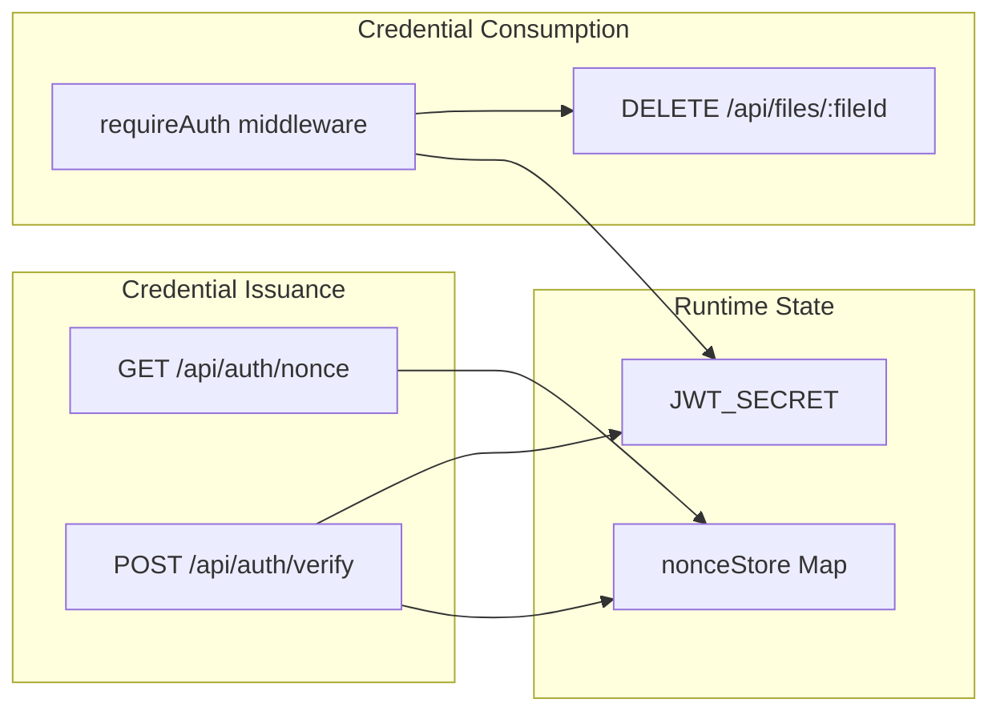

### Nonce Generation

**Endpoint:** `GET /api/auth/nonce`

```javascript
const nonce = crypto.randomBytes(16).toString('hex');
nonceStore.set(nonce, { created: Date.now() });
res.json({ nonce });
```

| Property | Value |
|----------|-------|
| Entropy | 16 bytes → 32 hex characters |
| Storage | `nonceStore` Map key |
| Metadata | `{ created: Date.now() }` |
| Response | `{ nonce: "..." }` |

**Purpose:** Bind the signed message to a single server-known secret, preventing replay of captured signatures.

**Why it exists:** Without a server nonce, a captured `(message, signature)` pair could be replayed to obtain fresh JWTs if the message had no expiry enforcement. The nonce ensures one-time use.

### Nonce Storage

```javascript
const nonceStore = new Map();
```

**In-memory only.** Not shared across processes. Lost on server restart.

**Cleanup mechanisms:**
1. **On successful verify:** `nonceStore.delete(nonceMatch[1])`
2. **Periodic sweep:** Every 10 minutes, delete entries where `now - created > 10 * 60 * 1000`

There is no maximum Map size — a nonce flooding attack could grow memory until cleanup runs.

### Nonce Expiration

| Mechanism | TTL |
|-----------|-----|
| Successful verify | Immediate deletion |
| Background interval | 10 minutes from `created` |
| Failed verify | Nonce remains until TTL sweep |

Expired nonces return `401 { error: "Invalid or expired nonce" }` on verify.

### Signature Verification

**Endpoint:** `POST /api/auth/verify`

**Request body (JSON, max 1 MB):**

```json
{
  "address": "0x...",
  "message": "Sign in to CLD Cloud Storage\n\n...",
  "signature": "0x..."
}
```

**Verification steps:**

1. Validate `address`, `message`, `signature` present — else **400**
2. `ethers.verifyMessage(message, signature)` → `recoveredAddress`
3. Compare `recoveredAddress.toLowerCase()` with `address.toLowerCase()` — else **401**
4. Extract nonce: `message.match(/Nonce: ([a-f0-9]+)/)` — must exist in `nonceStore` — else **401**
5. Delete nonce from store
6. `jwt.sign({ address: address.toLowerCase() }, JWT_SECRET, { expiresIn: '24h' })`
7. Return `{ token, address }`

**Message format is not validated** beyond nonce regex. The server does not verify `Issued At`, domain, or chain ID in the message. The client (`js/web3.js`) constructs the message; the server trusts any message containing a valid nonce.

**ethers loading:** `require('ethers')` is called inside the handler, not at top level. `ethers` is listed in `devDependencies` in `package.json` but is available when devDependencies are installed.

### JWT Generation

```javascript
jwt.sign({ address: address.toLowerCase() }, JWT_SECRET, { expiresIn: '24h' });
```

| Claim | Value |
|-------|-------|
| `address` | Lowercase checksummed hex string |
| `exp` | 24 hours from issuance (set by library) |
| Algorithm | Default HS256 |

No `iss`, `aud`, `sub`, or `jti` claims. No refresh token.

### JWT Validation

```javascript
function requireAuth(req, res, next) {
    const auth = req.headers.authorization;
    if (!auth || !auth.startsWith('Bearer ')) {
        return res.status(401).json({ error: 'Authentication required' });
    }
    try {
        const decoded = jwt.verify(auth.slice(7), JWT_SECRET);
        req.userAddress = decoded.address;
        next();
    } catch {
        return res.status(401).json({ error: 'Invalid or expired token' });
    }
}
```

**Applied to:** `DELETE /api/files/:fileId` only.

**Exposed to client:** `getAuthHeaders()` in `js/web3.js` returns `{ Authorization: 'Bearer ' + authToken }`.

### Auth Sequence Diagram (Full Flow)

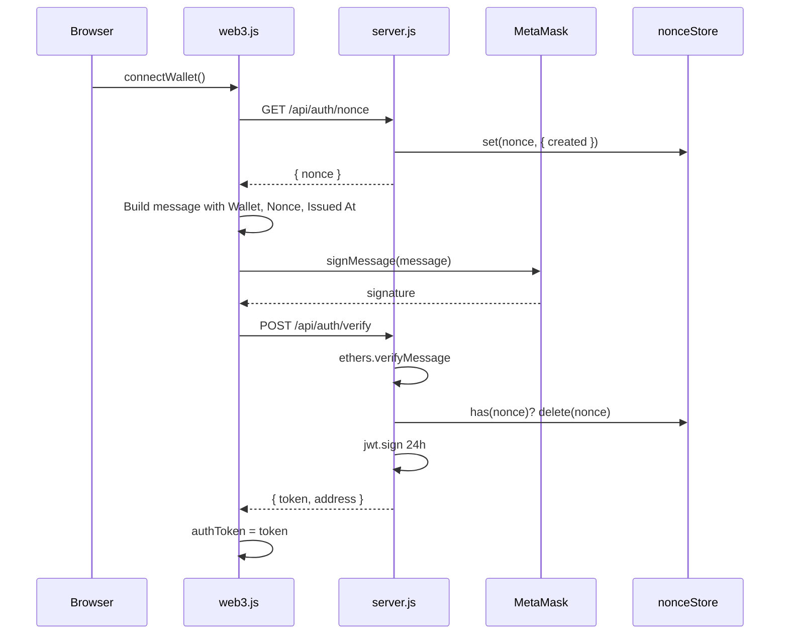

### Security Rationale

| Design choice | Rationale |
|---------------|-----------|
| SIWE before JWT | Wallets do not send HTTP cookies; JWT bridges Web3 identity to REST |
| One-time nonce | Prevents replay of captured signatures |
| 24h TTL | Limits window of stolen token abuse |
| Lowercase address in JWT | Normalizes comparison (though delete does not compare) |
| JWT only on delete | Minimal auth surface in current implementation |

### Auth Error Handling

| Condition | Status | Response |
|-----------|--------|----------|
| Missing fields on verify | 400 | `{ error: "Missing required fields" }` |
| Signature mismatch | 401 | `{ error: "Signature verification failed" }` |
| Invalid/expired nonce | 401 | `{ error: "Invalid or expired nonce" }` |
| ethers or unexpected error | 500 | `{ error: "Authentication failed" }` |
| Missing Bearer header | 401 | `{ error: "Authentication required" }` |
| Invalid/expired JWT | 401 | `{ error: "Invalid or expired token" }` |

### Auth Limitations

- Nonce store not distributed
- No binding between JWT and specific file operations
- Message format not strictly validated
- SIWE failure on connect is caught and logged as warning in frontend — wallet still connects
- `ethers` in devDependencies may be missing in production `npm install --production`

### Auth Future Improvements

- Use official `siwe` package with strict message parsing
- Redis-backed nonce store with TTL
- Bind JWT `jti` and rotate secrets
- Extend auth to upload/download
- Move `ethers` to `dependencies`
- Rate limit `/api/auth/verify` separately from general API limiter

---

## 9. Environment Variables

All variables are loaded via `require('dotenv').config()` from a `.env` file in the project root (if present) plus the process environment.

| Variable | Purpose | Default | Required | Security Implications |
|----------|---------|---------|----------|---------------------|
| `PORT` | HTTP listen port | `3000` | No | Low risk; expose only intended interfaces in production |
| `JWT_SECRET` | HMAC key for signing/verifying JWTs | Random 32-byte hex generated at each startup via `crypto.randomBytes(32)` | No (but strongly recommended for production) | **Critical.** If unset, secret changes every restart invalidating all tokens. If weak or leaked, attackers can forge JWTs and delete any file |
| `PINATA_API_KEY` | Pinata API key header | `undefined` | No | **Sensitive.** Grants ability to pin content to project's Pinata account. Also used as boolean gate: `if (PINATA_API_KEY)` enables pin attempt |
| `PINATA_SECRET_KEY` | Pinata secret API key header | `undefined` | No (required only for IPFS to work) | **Highly sensitive.** Paired with API key for Pinata authentication. Not checked at startup — missing secret causes silent pin failure |

### Variables Not Used by Backend

These exist elsewhere in the project but are **not read by `server.js`:**

| Variable / File | Used by |
|-----------------|---------|
| `js/config.js` | Frontend only |
| Hardhat network config | `hardhat.config.js`, deploy script |

### `.env` File Security

The repository `.gitignore` contains only `node_modules`. **`.env` is not gitignored** in the current project configuration. Operators must avoid committing secrets.

### Health Endpoint Exposure

`GET /api/health` returns:

```json
{
  "status": "ok",
  "ipfs": true,
  "siwe": true,
  "timestamp": "2026-07-03T..."
}
```

`ipfs: true` indicates `PINATA_API_KEY` is truthy — it does not verify Pinata connectivity or secret key validity.

---

## 10. Security

### Helmet

```javascript
app.use(helmet({ contentSecurityPolicy: false, crossOriginEmbedderPolicy: false }));
```

**Purpose:** Set HTTP headers (`X-Content-Type-Options`, `X-Frame-Options`, etc.) to reduce common web attacks.

**Disabled options:**
- `contentSecurityPolicy: false` — allows inline scripts and CDN ethers.js without CSP configuration
- `crossOriginEmbedderPolicy: false` — avoids breaking cross-origin resource loading

**Limitation:** Disabling CSP reduces XSS mitigation for the served SPA.

### CORS

```javascript
app.use(cors({
    origin: ['http://localhost:3000', 'http://127.0.0.1:3000'],
    methods: ['GET', 'POST', 'DELETE'],
    maxAge: 86400
}));
```

**Purpose:** Allow browser requests from local development origins.

**Limitation:** Production deployment on any other domain requires code change. No credentials/cookie CORS mode is configured (JWT sent via explicit header, not cookies).

### Rate Limiting

| Limiter | Scope | Window | Max | Response |
|---------|-------|--------|-----|----------|
| `apiLimiter` | `/api/*` | 15 minutes | 100 | `{ error: "Too many requests" }` |
| `uploadLimiter` | `POST /api/upload` only | 15 minutes | 30 | `{ error: "Too many uploads" }` |

Both limiters stack on upload routes (100 general + 30 upload-specific per IP).

**Limitation:** IP-based only. No per-wallet limits. Attackers with multiple IPs bypass limits.

### Upload Validation

| Control | Implementation |
|---------|----------------|
| Max size | 100 MB Multer limit |
| File count | 1 per request |
| Extension blocklist | 11 executable/script extensions |
| Path in filename | Reject `..` in original name |
| Extension sanitization | Strip non `[a-z0-9.]` from stored extension |

**Gaps:** No MIME sniffing, no content inspection, no authentication.

### Extension Blacklist

```javascript
const BLOCKED_EXT = new Set(['.exe', '.bat', '.cmd', '.com', '.msi', '.scr', '.pif', '.vbs', '.ps1', '.dll']);
```

Checked in Multer `fileFilter` against `path.extname(file.originalname).toLowerCase()`.

**Bypass vectors:** Double extensions (`file.pdf.exe` — extname is `.exe`, blocked), extensionless files (allowed), uppercase normalized via `.toLowerCase()`.

### Path Traversal Prevention

Applied in upload (post-rename), download, and delete:

```javascript
if (!path.resolve(filePath).startsWith(path.resolve(UPLOADS_DIR))) {
    return res.status(400).json({ error: 'Invalid path' });
}
```

Upload additionally rejects `..` in original filename before write.

### JWT

| Aspect | Implementation |
|--------|----------------|
| Algorithm | HS256 (jsonwebtoken default) |
| Secret source | Env or ephemeral random |
| Transport | `Authorization: Bearer` header |
| Storage on client | In-memory `authToken` variable |

**Threat:** Forged JWT if secret is known. Stolen JWT within 24h allows delete operations.

### Hash Validation

```javascript
function isValidFileId(fileId) {
    return /^[a-f0-9]{64}$/.test(fileId);
}
```

Applied on download and delete route params. Prevents injection of path segments via `:fileId` but does not verify the hash corresponds to an existing or authorized file.

### Known Security Gaps

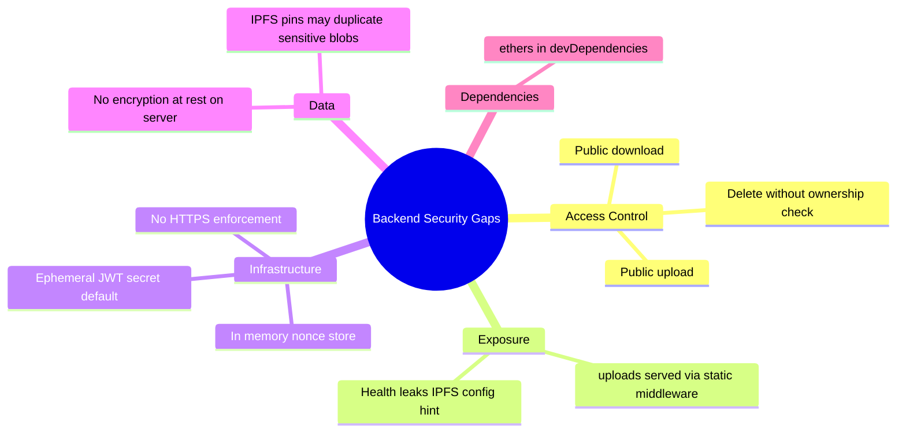

### Threat Model Summary

| Threat | Current mitigation | Residual risk |
|--------|-------------------|---------------|
| Anonymous disk fill | Upload rate limit | High — no auth, 30 uploads × 100MB |
| File theft by hash guess | 256-bit hash space | Low for guessing; high if hash leaked |
| Unauthorized delete | JWT required | High — any authenticated wallet |
| JWT forgery | HMAC secret | Medium if secret ephemeral or weak |
| Path traversal | resolve check | Low |
| Malware upload | Extension blocklist | Medium |
| XSS on SPA | CSP disabled | Medium |
| Nonce replay | One-time nonce | Low |
| Pinata key theft | Env vars | High if `.env` committed or logs expose |

### Mitigations (Existing)

- Helmet default headers (partial)
- CORS origin restriction
- Rate limiting on API and upload
- Extension blocklist
- Path traversal checks
- SIWE signature verification
- JWT expiry (24h)
- dotfiles denied in static serving

---

## 11. Error Handling

The backend uses try/catch in route handlers plus a single global error middleware. There is no structured error class hierarchy or error codes.

### Global Error Handler

```javascript
app.use((err, req, res, next) => {
    console.error('Error:', err.message);
    res.status(500).json({ error: 'Internal server error' });
});
```

**Triggered when:** A handler calls `next(err)`. Most route handlers catch internally and do not propagate to this handler.

### HTTP Status Code Reference

| Status | Endpoint(s) | Condition |
|--------|-------------|-----------|
| **200** | All successful operations | Normal response |
| **400** | Upload, download, delete, verify | Validation failure, bad path, multer filter error |
| **401** | Verify, delete | Auth failure, bad signature, bad nonce, bad JWT |
| **404** | Download, delete | File not found on disk |
| **413** | Upload | `LIMIT_FILE_SIZE` exceeded |
| **500** | All | Uncaught exception in handler |
| **429** | Rate-limited routes | Implicit via express-rate-limit (default status) |

Note: Rate limiter message is `{ error: 'Too many requests' }` or `{ error: 'Too many uploads' }` — status code 429 is express-rate-limit default.

### Exceptions by Subsystem

| Subsystem | Exception handling |
|-----------|-------------------|
| **Upload** | Multer errors in callback; try/catch with temp file cleanup |
| **Download** | try/catch → 500 generic message |
| **Delete** | try/catch → 500 generic message |
| **Auth verify** | try/catch → 500 `{ error: "Authentication failed" }` |
| **IPFS** | try/catch inside `pinToIPFS` → log + return `''` (non-fatal) |
| **JWT** | catch in `requireAuth` → 401 (swallows error type) |

### Validation Failures

All validation failures return JSON `{ error: "human readable string" }`. No field-level error arrays, no error codes.

### Upload Failures

| Failure | Cleanup |
|---------|---------|
| Before rename | Temp file may remain if error before catch |
| In catch block | `unlinkSync(req.file.path)` if exists |
| After rename | No rollback — partial state possible if IPFS or response fails after rename |

### IPFS Failures

Never fail the upload request. Error logged:

```javascript
console.error('IPFS pin error:', error.message);
return '';
```

Client receives `ipfsHash: ''` with `success: true`.

### JWT Failures

Generic messages — no distinction between expired, malformed, and wrong signature:

- `"Authentication required"`
- `"Invalid or expired token"`

### Filesystem Failures

`readFileSync`, `renameSync`, `unlinkSync`, `readdirSync` exceptions bubble to catch blocks → **500** with generic message. No retry logic.

### Logging

Errors logged via `console.error` with minimal context. No structured logging, log levels, or correlation IDs.

---

## 12. Performance

### Memory Usage

**Critical path — upload hashing:**

```javascript
const fileBuffer = fs.readFileSync(req.file.path);
const fileId = crypto.createHash('sha256').update(fileBuffer).digest('hex');
```

The entire file is loaded into memory twice in effect: once written by Multer, once read for hashing. For a 100 MB upload, peak memory includes the buffer plus Multer overhead.

**Nonce store:** Unbounded Map keyed by nonce string. Grows with nonce issuance rate until cleanup.

**No streaming hash:** SHA-256 is computed only after full file is on disk and loaded into RAM.

### Disk IO

| Operation | IO pattern |
|-----------|------------|
| Upload | Write temp (Multer) → read full file → rename (metadata op) |
| Download | readdir entire directory → stream file via send |
| Delete | readdir entire directory → unlink |
| IPFS pin | createReadStream (streaming read from disk) |

**Upload directory scan:** O(n) files in `uploads/` for every download and delete.

### Hashing

- Algorithm: SHA-256 via Node `crypto.createHash`
- Synchronous: blocks event loop during `readFileSync` and `digest`
- No incremental/streaming hash

### Large Files

| Constraint | Value |
|------------|-------|
| Max upload size | 100 MB |
| JSON body max | 1 MB (auth only) |
| Concurrent uploads | Limited by Node single thread + disk |

Near-limit files will cause noticeable event loop blocking during read/hash.

### Current Bottlenecks

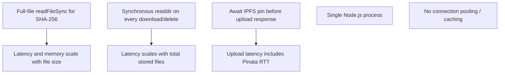

| Bottleneck | Impact |
|------------|--------|
| Full-buffer hashing | Memory spikes, event loop block |
| Directory scan lookup | Linear slowdown as `uploads/` grows |
| Synchronous IPFS await | Upload response time tied to Pinata |
| Single process | No horizontal scale without shared storage |
| Static + API same process | Large static transfers compete with API |

---

## 13. Current Limitations

Every architectural limitation of the backend as implemented:

### Structural

1. **Monolithic single file** — all logic in `server.js`; no modular boundaries for testing or reuse.
2. **No database** — no ownership registry, upload audit trail, or metadata index.
3. **No job queue** — IPFS pinning runs inline in request handler.
4. **Single process** — no cluster mode, no zero-downtime restart.

### Security and Access Control

5. **Public upload endpoint** — unauthenticated disk writes within rate limits.
6. **Public download endpoint** — possession of `fileId` sufficient for access.
7. **Delete without ownership** — JWT proves identity, not file ownership.
8. **No server-blockchain linkage** — server cannot verify on-chain owner.
9. **`uploads/` potentially web-accessible** via static middleware.
10. **Ephemeral JWT secret** when `JWT_SECRET` unset.
11. **CORS localhost only** — not production-ready without modification.
12. **CSP disabled** — reduced XSS protection for co-hosted SPA.

### Storage

13. **Flat `uploads/` directory** — no sharding; lookup scans all files.
14. **No deduplication feedback** — identical content overwrites silently.
15. **No orphan cleanup** — failed chain txs leave blobs; failed server deletes leave chain entries (client-side).
16. **No IPFS unpin on delete** — pinned content may persist on Pinata after disk delete.
17. **Temp files in same directory as finals** — same folder as served content root.

### Authentication

18. **In-memory nonce store** — lost on restart; not multi-instance safe.
19. **SIWE message not fully validated** — only nonce regex checked.
20. **JWT used only for delete** — inconsistent auth model.
21. **`ethers` in devDependencies`** — may be absent in production-only installs.

### Reliability

22. **IPFS failure silent** — client cannot distinguish pin failure from disabled IPFS.
23. **No health check for disk space** — `/api/health` does not verify writability.
24. **No graceful shutdown** — in-flight requests not drained on SIGTERM.
25. **Global error handler rarely used** — handlers swallow most errors internally.

### Operational

26. **No request logging middleware** — only console.log on specific events.
27. **No metrics or tracing** — no Prometheus, OpenTelemetry, etc.
28. **100 MB hard limit** — not configurable via env.
29. **Blocked extensions hardcoded** — not configurable via env.
30. **Pinata gate checks API key only** — secret key absence not surfaced at startup.

---

## 14. Future Improvements

Improvements compatible with the existing single-server architecture, ordered by impact:

### Access Control (High Priority)

- **Upload registry:** On successful upload, record `{ fileId, ownerAddress }` in SQLite/JSON file if JWT extended to upload; verify on download/delete.
- **Auth on download:** Require valid JWT; optional public share tokens for specific files.
- **Delete ownership check:** Compare `req.userAddress` to registry before `unlinkSync`.

### Storage (Medium Priority)

- **Streaming SHA-256:** Replace `readFileSync` with `createReadStream` piped to hash — same content-addressed model, lower memory.
- **File index:** Maintain in-memory `Map<fileId, filename>` refreshed on upload/delete/start — same API, faster lookup.
- **Temp directory:** Use `os.tmpdir()` or `uploads/.tmp/` excluded from static serving.
- **Block static access to uploads:** Add explicit middleware to deny `GET /uploads/*` through static handler.

### IPFS (Medium Priority)

- **Startup validation:** Log warning if `PINATA_API_KEY` set without `PINATA_SECRET_KEY`.
- **Async pin queue:** Return upload response immediately; background pin with callback or client polling endpoint for `ipfsHash` update.
- **Unpin on delete:** Call Pinata unpin API when deleting files that have known CIDs (requires storing CID server-side).

### Authentication (Medium Priority)

- **Redis nonce store:** Drop-in replacement for `Map` with TTL; enables multi-instance.
- **Stable JWT secret:** Fail startup if `JWT_SECRET` unset in production mode.
- **Structured SIWE validation:** Validate message fields with `siwe` package.

### Operations (Lower Priority)

- **Extract modules:** Split into `routes/`, `middleware/`, `services/pinata.js` without changing behavior.
- **Configurable limits:** `MAX_UPLOAD_BYTES`, `RATE_LIMIT_*` via env.
- **Health check depth:** Verify disk writable, report `uploads/` count and size.
- **Graceful shutdown:** Close server on SIGTERM after in-flight requests complete.
- **Move ethers to dependencies**

---

## 15. Backend File Reference

### Primary Backend Files

| File | Role | Why It Exists |
|------|------|---------------|
| **`server.js`** | Complete backend implementation | Single entry point for HTTP API, auth, upload/download/delete, static hosting, and IPFS integration. npm `main` field points here. |
| **`.env`** | Secret and config storage (optional) | Holds `JWT_SECRET`, Pinata keys, optional `PORT`. Loaded by dotenv. Not read by code directly — env vars only. |
| **`uploads/`** | Blob storage directory | Content-addressed file store. Created at runtime. Not source code but critical backend data directory. |
| **`package.json`** | Dependency manifest and scripts | Declares Express ecosystem dependencies, `dev`/`start` scripts invoking `node server.js`. |
| **`package-lock.json`** | Locked dependency tree | Ensures reproducible installs of backend packages. |

### Supporting Files (Backend-Adjacent)

These files are not imported by `server.js` but are required for the backend to operate in the full application context:

| File | Relationship to Backend |
|------|-------------------------|
| **`index.html`** | Served by `express.static` as SPA entry |
| **`js/*.js`** | Served statically; frontend consumes backend API |
| **`style.css`** | Served statically |
| **`logo CLD.svg`** | Served statically |
| **`hardhat.config.js`** | Not used by backend; blockchain is client-side |
| **`scripts/deploy.js`** | Not used by backend; generates frontend `config.js` |
| **`contracts/CloudStorage.sol`** | Not used by backend; on-chain metadata only |

### npm Dependencies Used by `server.js`

| Package | Version (package.json) | Role in Backend |
|---------|------------------------|-----------------|
| `express` | ^4.18.2 | HTTP server, routing, static, download |
| `multer` | ^1.4.5-lts.1 | Multipart parsing and disk write |
| `cors` | ^2.8.5 | CORS policy |
| `helmet` | ^8.1.0 | Security headers |
| `express-rate-limit` | ^8.2.1 | Rate limiting |
| `jsonwebtoken` | ^9.0.3 | JWT sign and verify |
| `form-data` | ^4.0.5 | Pinata multipart upload |
| `dotenv` | ^17.3.1 | Load `.env` |
| `ethers` | ^6.9.0 (devDependencies) | `verifyMessage` in auth verify |

### Node.js Built-in Modules

| Module | Usage |
|--------|-------|
| `crypto` | Nonces, SHA-256, random JWT secret |
| `path` | Safe path joining and extension parsing |
| `fs` | Directory creation, read, rename, unlink, readdir, streams |

---

*Document version: 1.0 — describes `server.js` implementation as of repository analysis. Does not cover frontend or smart contract internals; see `docs/architecture.md` for system-wide context.*
