# CLD Frontend — Implementation Reference

This document describes how the **browser SPA** is implemented in this repository. It is written for frontend engineers who need to maintain, debug, or extend UI behavior, module interactions, and client-side orchestration of REST and blockchain calls.

The frontend is a **vanilla JavaScript single-page application** with no bundler, no framework, and no module system. All logic is loaded via ordered `<script>` tags into the global scope. The Express server co-hosts static assets from the project root.

---

## Table of Contents

1. [Frontend Overview](#1-frontend-overview)
2. [Module Architecture](#2-module-architecture)
3. [Bootstrap and Script Load Order](#3-bootstrap-and-script-load-order)
4. [DOM Structure and UI Shell](#4-dom-structure-and-ui-shell)
5. [State Management](#5-state-management)
6. [Inter-Module Communication](#6-inter-module-communication)
7. [Page Routing and Navigation](#7-page-routing-and-navigation)
8. [Wallet Connection Flow](#8-wallet-connection-flow)
9. [File Upload Flow](#9-file-upload-flow)
10. [File List Rendering and Actions](#10-file-list-rendering-and-actions)
11. [Preview, Download, and Share](#11-preview-download-and-share)
12. [Delete and Rename Flows](#12-delete-and-rename-flows)
13. [Encryption Integration](#13-encryption-integration)
14. [Activity Log](#14-activity-log)
15. [Search, Categories, and Stats](#15-search-categories-and-stats)
16. [Responsive and Mobile Behavior](#16-responsive-and-mobile-behavior)
17. [Presentation Layer (style.css)](#17-presentation-layer-stylecss)
18. [Error Handling and User Feedback](#18-error-handling-and-user-feedback)
19. [Security Considerations (Frontend)](#19-security-considerations-frontend)
20. [Current Limitations](#20-current-limitations)
21. [Future Improvements](#21-future-improvements)
22. [Frontend File Reference](#22-frontend-file-reference)

---

## 1. Frontend Overview

### Role in the System

The frontend is the **orchestration layer**. It is the only component that simultaneously talks to:

- **MetaMask** (`window.ethereum`) for wallet signatures and contract transactions
- **Express REST API** (`CONFIG.SERVER.url`) for blob upload, download, delete, and SIWE
- **Web Crypto API** (`crypto.subtle`) for client-side encryption

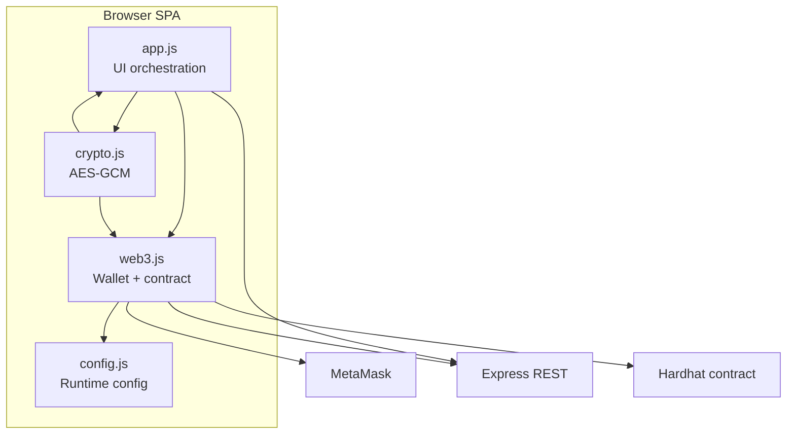

The server never calls the contract. The contract never serves bytes. **Every multi-step user operation is sequenced in the frontend.**

### Why This Frontend Exists

| Responsibility | Why it cannot live elsewhere |
|----------------|------------------------------|
| Upload pipeline (encrypt → REST → chain tx) | Only the browser has the user's file, wallet, and encryption key |
| File list and preview | No server-side rendering; static HTML shell |
| SIWE message signing | Private keys remain in MetaMask |
| Contract `uploadFile`, `deleteFile`, `renameFile` | Transactions must be signed by user wallet |
| Activity timeline from events | `queryFilter` runs via ethers in browser |

### Technology Choices (This Repo)

| Choice | Implementation |
|--------|----------------|
| UI framework | None — direct DOM manipulation |
| Module system | None — global functions and objects |
| ethers.js | CDN v6.9.0 (`ethers.umd.min.js`) |
| Styling | Single `style.css`, CSS custom properties |
| Icons | Inline SVG strings in `HERO_ICONS` object and HTML |
| Build step | None |

---

## 2. Module Architecture

Four JavaScript files plus one HTML shell and one stylesheet constitute the entire frontend.

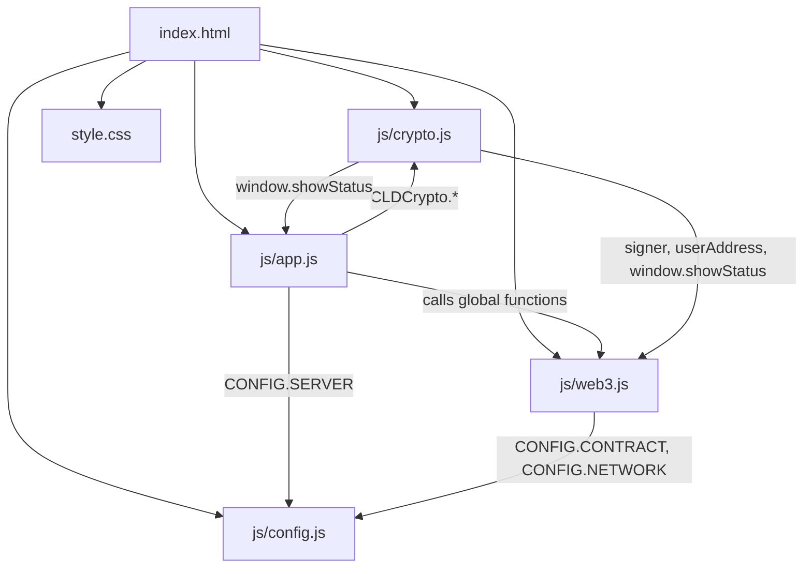

### Module Summary

| Module | Lines (approx.) | Purpose | Why separate |
|--------|-----------------|---------|--------------|
| **`js/config.js`** | ~315 | Contract address, ABI, network, server URL | Auto-generated by deploy script; must not be hand-edited |
| **`js/web3.js`** | ~225 | Wallet, SIWE, contract wrappers, activity log | Isolates ethers.js and chain state from UI |
| **`js/crypto.js`** | ~72 | AES-256-GCM encrypt/decrypt, key derivation | Isolates Web Crypto API; depends on wallet signer |
| **`js/app.js`** | ~604 | DOM binding, routing, upload/list/actions | Largest surface; pure UI orchestration |
| **`index.html`** | ~320 | Structure, element IDs, modals, script tags | SPA shell — no templating |
| **`style.css`** | ~1676 | Layout, theme, responsive rules | Presentation only |

---

## 3. Bootstrap and Script Load Order

Scripts at the bottom of `index.html`:

```html
<script src="https://cdnjs.cloudflare.com/ajax/libs/ethers/6.9.0/ethers.umd.min.js"></script>
<script src="js/config.js"></script>
<script src="js/crypto.js"></script>
<script src="js/web3.js"></script>
<script src="js/app.js"></script>
```

### Load Order Rationale

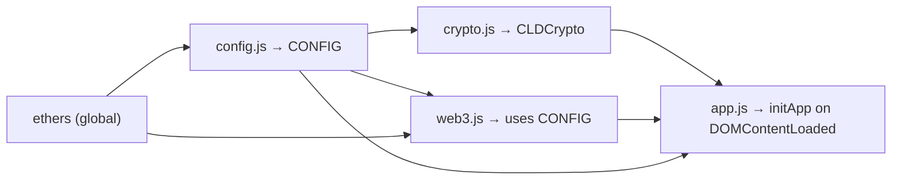

| Order | Script | Dependency |
|-------|--------|------------|
| 1 | `ethers.umd.min.js` | Must exist before `web3.js` uses `ethers.BrowserProvider`, `ethers.Contract` |
| 2 | `config.js` | Defines global `CONFIG`; required by `web3.js` and `app.js` |
| 3 | `crypto.js` | Defines `CLDCrypto`; references `signer`, `userAddress` at runtime (not load time) |
| 4 | `web3.js` | Defines wallet/contract globals; uses `CONFIG` |
| 5 | `app.js` | Calls `connectWallet`, `CLDCrypto`, etc.; registers `DOMContentLoaded` |

**Entry point:** `document.addEventListener('DOMContentLoaded', () => initApp());` at line 21 of `app.js`.

**Failure modes if order changes:**
- `web3.js` before `config.js` → `CONFIG is not defined`
- `web3.js` before ethers CDN → `ethers is not defined`
- `app.js` before `web3.js` → `connectWallet is not defined` at runtime (functions exist by event time if order preserved)

---

## 4. DOM Structure and UI Shell

### Layout Hierarchy

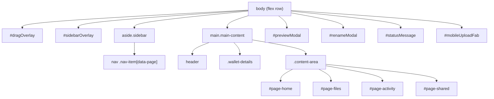

### Critical Element IDs (Used by `app.js`)

| ID / Selector | Purpose |
|---------------|---------|
| `#connectWallet` | Wallet connect button |
| `#walletAddress` | Truncated address display |
| `#networkInfo`, `#balanceInfo` | Wallet details row |
| `#uploadZone`, `#fileInput` | Upload interaction |
| `#encryptToggle` | Encryption checkbox |
| `#homeFileList`, `#filesFileList` | File list containers |
| `#searchBar` | Client-side filter |
| `#totalFiles`, `#totalSize`, `#totalShared` | Stats cards |
| `#uploadProgress`, `#progressBar`, `#progressText` | Upload progress |
| `#dragOverlay` | Full-screen drop target |
| `#activityList` | Activity page content |
| `#previewModal`, `#previewTitle`, `#previewBody` | File preview |
| `#renameModal`, `#renameInput`, `#renameConfirm` | Rename dialog |
| `#statusMessage` | Toast notifications |
| `#hamburgerBtn`, `#sidebarOverlay` | Mobile navigation |
| `#mobileUploadFab` | Mobile upload button |

### Pages in HTML

| Element | `data-page` / ID | Default visibility |
|---------|------------------|-------------------|
| Home | `data-page="home"`, `#page-home` | Visible |
| My Files | `data-page="files"`, `#page-files` | `display:none` |
| Activity | `data-page="activity"`, `#page-activity` | `display:none` |
| Shared | `data-page="shared"`, `#page-shared` | `display:none` — **static placeholder only** |

### Modals and Global Handlers

Preview and rename modals use inline HTML handlers:

```html
onclick="if(event.target===this)closePreviewModal()"
onclick="closeRenameModal()"
```

File row actions use inline `onclick` on dynamically generated buttons:

```html
onclick="viewFileAction('...','...',true)"
```

These call **global functions** defined at module scope in `app.js` (outside `initApp`), because strings in `innerHTML` cannot reference closure-scoped functions.

---

## 5. State Management

There is no Redux, Context, or reactive store. State lives in **module globals** and **`initApp` closure variables**.

### State Inventory

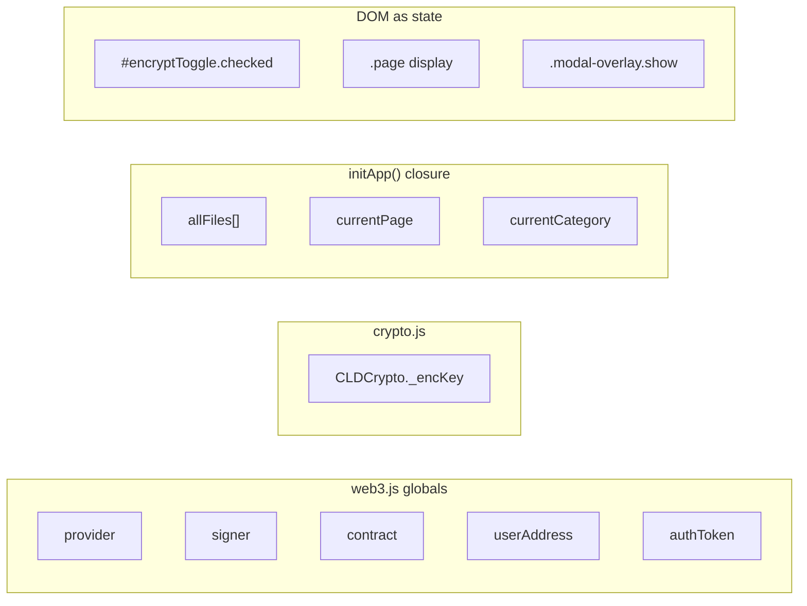

| State | Location | Mutated by | Read by |
|-------|----------|------------|---------|
| `provider`, `signer`, `contract` | `web3.js` | `connectWallet()` | All contract functions |
| `userAddress` | `web3.js` | `connectWallet()` | SIWE, crypto key message, event filters |
| `authToken` | `web3.js` | `signInWithEthereum()` | `getAuthHeaders()` → delete |
| `CLDCrypto._encKey` | `crypto.js` | `deriveKey()` | encrypt/decrypt |
| `allFiles` | `initApp` closure | `loadFiles()` | render, search, stats, filter |
| `currentPage` | `initApp` closure | `switchPage()` | search target, lazy loads |
| `currentCategory` | `initApp` closure | category tab clicks | `filterByCategory()` |

### State Refresh Triggers

| Event | State updated |
|-------|---------------|
| Connect wallet | web3 globals, UI wallet display, `loadFiles()` |
| Upload complete | `loadFiles()` → `allFiles` |
| Delete / rename complete | `window.loadFiles()` |
| Chain/account change | **Full `window.location.reload()`** |
| Page switch to Activity | `loadActivity()` (fresh event query) |
| Page switch to Files | Re-render from cached `allFiles` |

### Exposed Window Globals

`initApp` intentionally exposes:

```javascript
window.showStatus = showStatus;
window.loadFiles = loadFiles;
```

**Why:** `crypto.js` calls `window.showStatus` during key derivation. Global action functions call `window.showStatus` and `window.loadFiles` after async chain operations.

---

## 6. Inter-Module Communication

### Communication Matrix

| From | To | Mechanism | Data |
|------|----|-----------|------|
| `app.js` | `web3.js` | Global function calls | `connectWallet`, `uploadFileOnChain`, `getFilesFromChain`, etc. |
| `app.js` | `crypto.js` | `CLDCrypto.encrypt/decrypt` | `ArrayBuffer` |
| `app.js` | Backend | `fetch(CONFIG.SERVER.url + '/api/...')` | FormData, JSON, headers |
| `web3.js` | Backend | `fetch` for SIWE | nonce, verify body |
| `web3.js` | Contract | `ethers.Contract` methods | via MetaMask signer |
| `crypto.js` | `web3.js` | Reads `signer`, `userAddress` | implicit global dependency |
| `crypto.js` | `app.js` | `window.showStatus` | toast messages |
| All modules | `config.js` | Global `CONFIG` | URLs, address, ABI |

### Dual Backend + Chain Pattern

Most write operations use a **two-phase client sequence**:

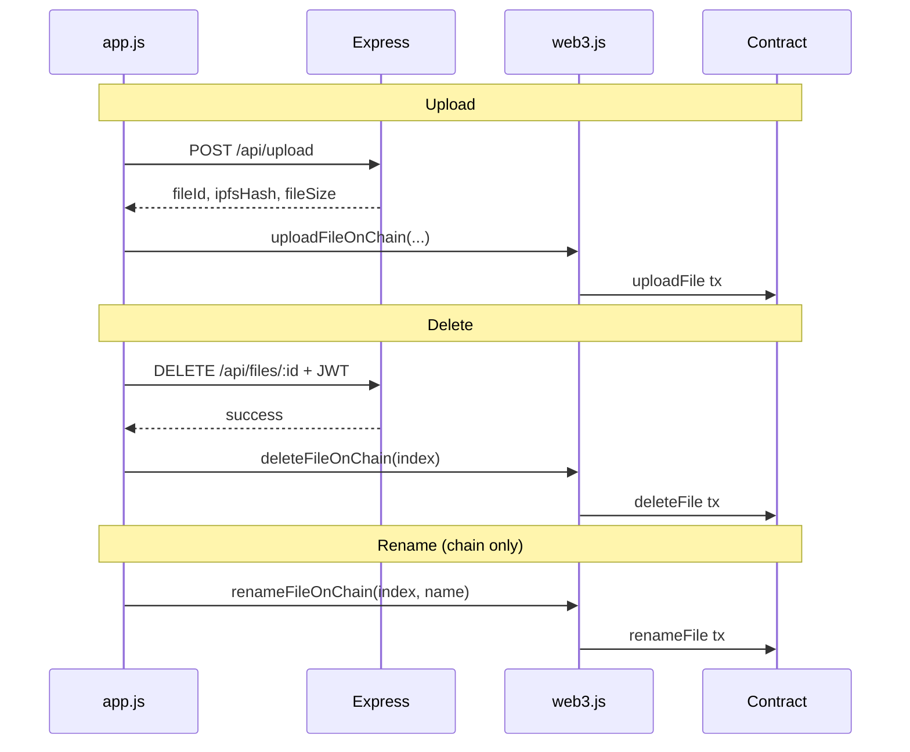

There is no frontend transaction coordinator — if phase two fails, state is inconsistent (documented in architecture/backend docs).

---

## 7. Page Routing and Navigation

### Implementation

Routing is **not URL-based**. There is no `history.pushState`, no hash router, no path segments.

```javascript
function switchPage(page) {
    currentPage = page;
    // Update nav active class
    // Hide all .page elements
    // Show #page-{page}
    if (page === 'activity') loadActivity();
    if (page === 'files') renderFileList(filterByCategory(allFiles), filesFileList);
}
```

### Navigation Triggers

| Trigger | Handler |
|---------|---------|
| Sidebar `.nav-item[data-page]` click | `switchPage(this.dataset.page)` |
| Mobile nav click | Same + `closeSidebar()` if `isMobile()` |

### Page-Specific Behavior

| Page | On enter |
|------|----------|
| `home` | No extra load; shows first 5 of `allFiles` |
| `files` | Re-render full filtered list |
| `activity` | Fetch events via `getActivityLog()` |
| `shared` | **Nothing** — static HTML empty state |

### Why URL routing was omitted

The implementation prioritizes simplicity for a local demo. Deep-linking to a page or file is not supported.

---

## 8. Wallet Connection Flow

### Trigger

`#connectWallet` click → `connectWallet()` in `web3.js`.

### Internal Sequence

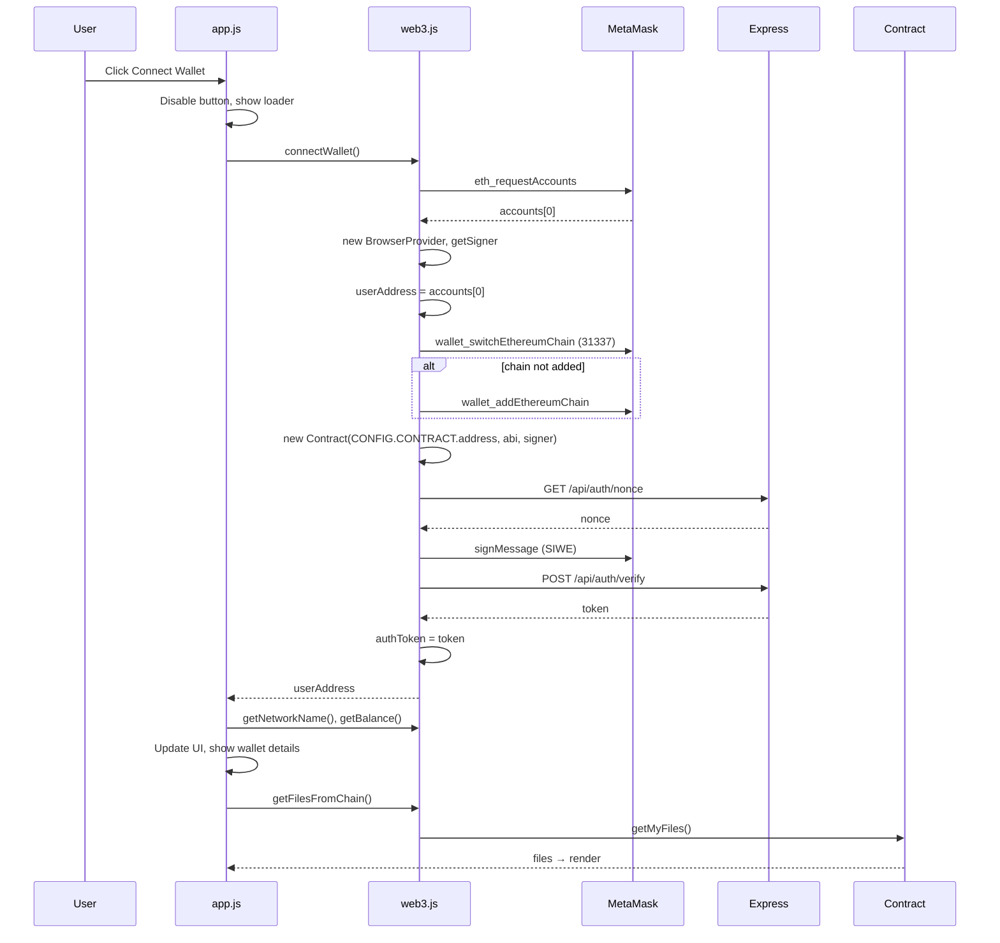

### SIWE Failure Handling

```javascript
try {
    await signInWithEthereum();
} catch (e) {
    console.warn('SIWE skipped:', e.message);
}
```

Wallet connection **succeeds even if SIWE fails**. Delete operations will then fail with 401 until user re-authenticates (no retry UI exists).

### Wallet Event Listeners

```javascript
setupWalletListeners(
    () => window.location.reload(),           // chainChanged
    (accs) => { /* toast */; window.location.reload(); }  // accountsChanged
);
```

**Why full reload:** Simplest way to reset all module globals (`provider`, `contract`, `authToken`, `CLDCrypto._encKey`, `allFiles`) without explicit teardown.

### UI Updates on Connect

| Element | Update |
|---------|--------|
| `#connectWallet` | Hidden |
| `#walletAddress` | `0x1234...abcd` truncated |
| `.wallet-details` | Shown with network name and balance |
| Balance label | `parseFloat(balance).toFixed(4) + ' CLD'` — native ETH on Hardhat, labeled CLD in UI |

### CONFIG Mismatch (Chain Add)

`config.js` defines `NETWORK.currency` but `web3.js` reads `NETWORK.nativeCurrency`:

```javascript
nativeCurrency: {
    name: CONFIG.NETWORK.nativeCurrency?.name || 'Ether',
    symbol: CONFIG.NETWORK.nativeCurrency?.symbol || 'ETH',
    ...
}
```

MetaMask "Add chain" dialog may show **ETH** instead of **CLD** unless deploy script and config schema are aligned.

---

## 9. File Upload Flow

### Guards

Upload triggers check `userAddress` (global from `web3.js`):

```javascript
if (!userAddress) return showStatus('⚠️ Connect wallet first', 'error');
```

Applied to: upload zone click, file input change, drag-drop handlers, mobile FAB.

**Note:** Backend upload endpoint does not enforce this — guard is UI-only.

### Upload Entry Points

| Entry | Condition |
|-------|-----------|
| `#uploadZone` click | Desktop and mobile |
| `#fileInput` change | After file picker |
| `#uploadZone` drop | Desktop only (`!isMobile()`) |
| `#dragOverlay` drop | Desktop only |
| `#mobileUploadFab` click | Mobile — triggers `#fileInput.click()` |

### `handleFileUpload(fileList)` Workflow

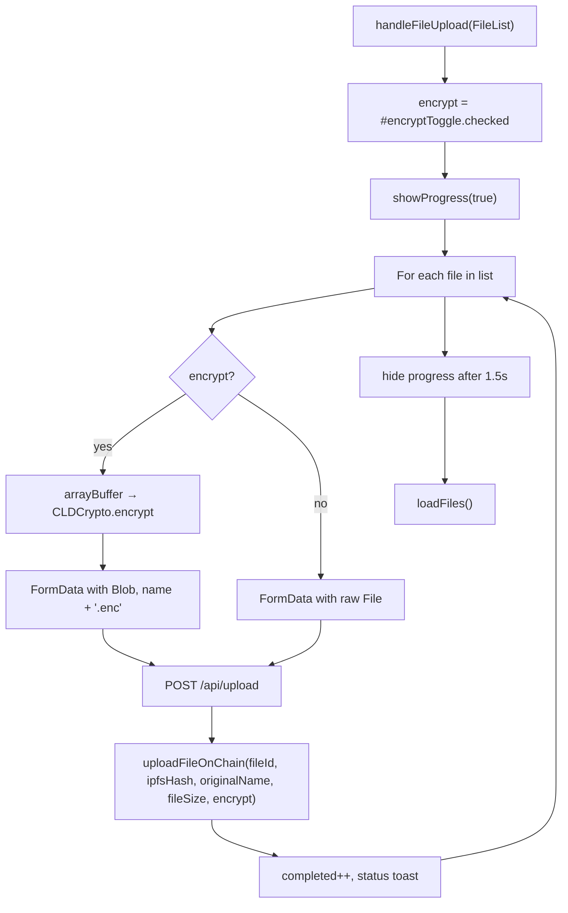

### Per-File Field Mapping

| Field | Encrypted upload | Plain upload |
|-------|------------------|--------------|
| Multipart filename | `{original}.enc` | original name |
| On-chain `fileName` | original name (no `.enc`) | original name |
| On-chain `fileSize` | encrypted blob size from server | raw size |
| On-chain `isEncrypted` | `true` | `false` |
| Server `fileId` | SHA-256 of ciphertext | SHA-256 of raw bytes |

### Progress UI

```javascript
function updateProgress(cur, total, text) {
    const pct = total > 0 ? Math.round((cur / total) * 100) : 0;
    progressBar.style.width = pct + '%';
    progressText.textContent = text;
}
```

Progress percentage uses **completed count**, not per-file byte progress. Multi-file upload shows 0% until each file completes entirely.

### Batch Upload

`#fileInput` has `multiple` attribute. `handleFileUpload` loops sequentially — **not parallel**. One failure does not abort subsequent files in the batch.

### Error Handling

Per-file try/catch with `showStatus('Failed: ${file.name}: ${error.message}', 'error')`. Partial batch success is allowed.

---

## 10. File List Rendering and Actions

### Data Source

```javascript
allFiles = await getFilesFromChain();
```

Each item is normalized in `web3.js`:

```javascript
{
    index,           // array index — required for delete/rename
    fileId,
    ipfsHash,
    fileName,
    fileSize,        // Number
    uploadTime,      // ms (chain seconds × 1000)
    owner,
    isEncrypted
}
```

### Render Targets

| Container | Content |
|-----------|---------|
| `#homeFileList` | `allFiles.slice(0, 5)` — **not** sorted by date; chain array order |
| `#filesFileList` | Full list after category filter |

### Row HTML Generation

`renderFileList(files, container)` builds rows with `document.createElement` + `innerHTML`:

- **Icon:** `getFileIcon(fileName)` from extension map
- **Badges:** 🔒 if `isEncrypted`, 📌 if `ipfsHash`
- **Truncated hash:** first 16 chars of `fileId`
- **Kebab menu:** dropdown with five actions

### XSS Mitigation in Templates

| Function | Usage |
|----------|-------|
| `escapeHtml(s)` | Text content via temporary DOM node |
| `escapeAttr(s)` | Attribute values in onclick strings |

**Residual risk:** `file.isEncrypted` is injected as raw boolean in onclick (`${file.isEncrypted}`). Safe (boolean). File names in onclick use `escapeAttr`.

### Dropdown Behavior

- Kebab click: `stopPropagation`, toggle `.show` on `#dropdown-{index}`
- Document click: close all `.file-dropdown.show`
- Only one dropdown open at a time

### Action → Backend / Chain Mapping

| Action | Function | API | Chain |
|--------|----------|-----|-------|
| View | `viewFileAction` | GET `/api/files/:id` | — |
| Rename | `renameFileAction` | — | `renameFile(index, name)` |
| Download | `downloadFileAction` | GET `/api/files/:id` | — |
| Share | `shareFileAction` | — (clipboard only) | — |
| Delete | `deleteFileAction` | DELETE `/api/files/:id` + JWT | `deleteFile(index)` |

---

## 11. Preview, Download, and Share

### Preview (`viewFileAction`)

Opens `#previewModal` with loading state, then branches on `isEncrypted` and file extension.

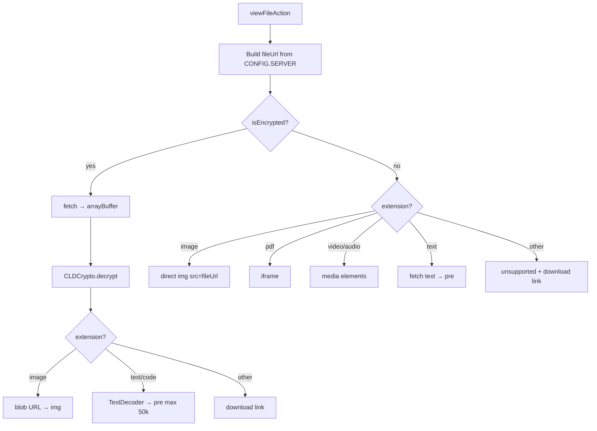

**Encrypted PDF/video:** No inline preview — falls through to "Decrypted successfully" download link branch.

**Blob URL cleanup:** `URL.createObjectURL` used for encrypted previews; **not revoked** on modal close (potential memory leak on repeated previews).

### Modal Close

```javascript
function closePreviewModal() {
    modal.classList.remove('show');
    // pause video/audio if present
}
```

### Download (`downloadFileAction`)

| Mode | Behavior |
|------|----------|
| Plain | Synthetic `<a href={url} download>` click |
| Encrypted | fetch → decrypt → Blob → object URL → download → `revokeObjectURL` |

### Share (`shareFileAction`)

```javascript
if (ipfsHash) {
    link = 'https://gateway.pinata.cloud/ipfs/' + ipfsHash;
} else {
    link = CONFIG.SERVER.url + '/api/files/' + encodeURIComponent(fileId);
}
await navigator.clipboard.writeText(link);
```

**No encrypted-file warning** — IPFS link points to ciphertext. Server link is public (no auth in URL).

---

## 12. Delete and Rename Flows

### Delete

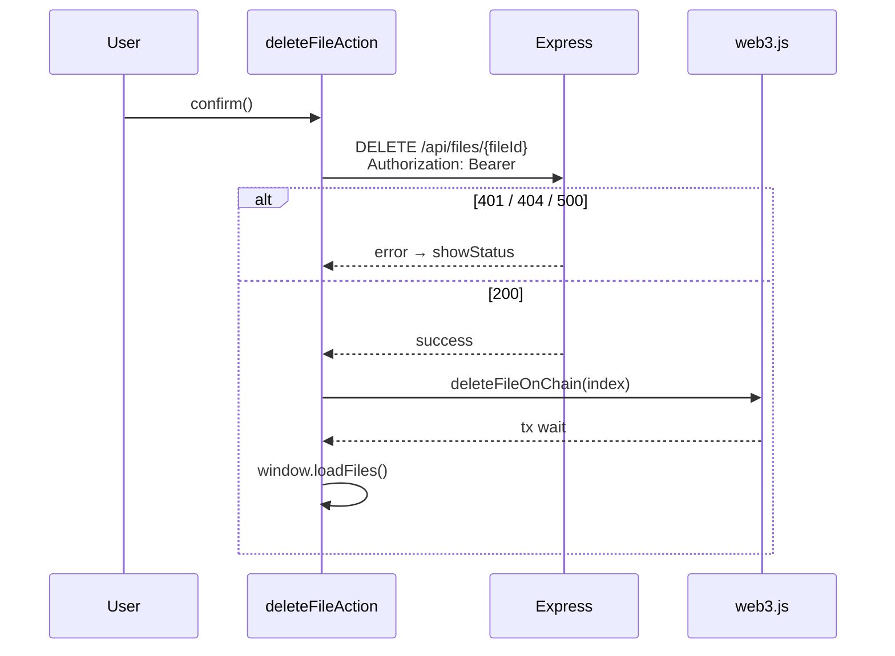

**Index dependency:** `index` comes from last `getFilesFromChain()` mapping. If another tab deleted files or chain state changed, wrong index may delete wrong metadata entry.

**JWT dependency:** If SIWE failed during connect, `getAuthHeaders()` returns `{}` → server returns 401.

### Rename

Chain-only operation — no server API.

```javascript
const parts = currentName.split('.');
const ext = parts.length > 1 ? '.' + parts.pop() : '';
input.value = parts.join('.');  // user edits basename only
// Confirm: newName = input.value.trim() + input.dataset.ext
await renameFileOnChain(parseInt(input.dataset.index), newName);
```

**Confirm button rebind:** `confirmBtn.cloneNode(true)` replaces button each open to prevent duplicate listeners.

**Keyboard:** Enter confirms, Escape closes.

---

## 13. Encryption Integration

### Module: `CLDCrypto` in `crypto.js`

**Why separate from `web3.js`:** Encryption uses Web Crypto API; wallet module uses ethers. Different lifecycles and user prompts.

### Key Derivation (Distinct from SIWE)

| Aspect | SIWE | Encryption key |
|--------|------|------------------|
| Message prefix | `Sign in to CLD Cloud Storage` | `CLD Cloud Storage Encryption Key` |
| Purpose | JWT for delete | AES-256-GCM key |
| When prompted | Every connect | First encrypt/decrypt in session |
| Cached | `authToken` | `CLDCrypto._encKey` |

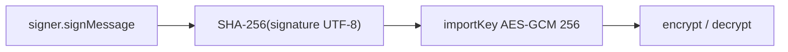

### Wire Format

```
[ 12-byte IV ][ AES-GCM ciphertext including auth tag ]
```

### Integration Points in `app.js`

| Operation | Crypto call |
|-----------|-------------|
| Upload (toggle on) | `CLDCrypto.encrypt(arrayBuffer)` before FormData |
| Preview encrypted | `CLDCrypto.decrypt(encBuffer)` after fetch |
| Download encrypted | Same as preview path |

### `clearKey()` Usage

Defined but **never called** on wallet disconnect/reload. Full page reload clears memory implicitly.

---

## 14. Activity Log

### Load Trigger

`switchPage('activity')` → `loadActivity()` → `getActivityLog()` in `web3.js`.

### Event Queries

Three separate `contract.queryFilter` calls filtered by `userAddress`:

| Event | Mapped fields |
|-------|---------------|
| `FileUploaded` | fileName, fileId, ipfsHash, fileSize, isEncrypted, blockNumber, txHash, timestamp from event args |
| `FileDeleted` | fileId, blockNumber, txHash, timestamp from block header |
| `FileRenamed` | fileName as `old → new`, timestamp from block |

Sorted by `blockNumber` descending.

### UI Rendering

Each event → `.activity-item` with icon from `HERO_ICONS[event.type]`, truncated tx hash with full hash in `title` attribute.

### Failure Modes

- `getActivityLog` catch → returns `[]`
- Empty → empty state HTML
- Requires connected wallet with valid `contract` and `userAddress`

**Not loaded on connect** — only when user navigates to Activity page.

---

## 15. Search, Categories, and Stats

### Search

`#searchBar` `input` event:

```javascript
const target = currentPage === 'files' ? filesFileList : homeFileList;
const base = currentPage === 'files' ? filterByCategory(allFiles) : allFiles.slice(0, 5);
// filter: fileName or fileId includes query (case-insensitive)
```

Search does not query backend or chain — filters cached `allFiles` only.

### Category Tabs

`getCategory(fileName)` maps extension to: `images`, `videos`, `documents`, `audio`, `archives`, `code`, or `other`.

Only affects `#page-files` via `filterByCategory(allFiles)`.

### Stats (Home page)

| Element | Calculation |
|---------|-------------|
| `#totalFiles` | `files.length` |
| `#totalSize` | Sum of `fileSize` |
| `#totalShared` | Count where `ipfsHash` truthy |

Updated on every `loadFiles()`.

### Date Formatting

```javascript
new Date(ts).toLocaleDateString('id-ID', { day: '2-digit', month: 'short', year: 'numeric' });
```

Hardcoded **`id-ID`** locale — displays Indonesian-formatted dates regardless of user locale.

---

## 16. Responsive and Mobile Behavior

### Breakpoints (`style.css`)

| Breakpoint | Behavior |
|------------|----------|
| `max-width: 900px` (769–900) | Tablet adjustments |
| `max-width: 768px` | Mobile layout — primary breakpoint for JS |
| `max-width: 400px` | Small phone tweaks |

### JavaScript Mobile Detection

```javascript
const mobileQuery = window.matchMedia('(max-width: 768px)');
function isMobile() { return mobileQuery.matches; }
```

Evaluated at **init time** for drag handlers — resize from desktop to mobile without reload does not attach/detach drag listeners.

### Mobile-Specific UX

| Feature | Desktop | Mobile |
|---------|---------|--------|
| Upload zone visible | Yes | Hidden in CSS |
| Drag-and-drop | Yes | Not registered |
| Full-screen drag overlay | Yes | Hidden |
| Upload trigger | Click zone / drop | `#mobileUploadFab` → file picker |
| Sidebar | Fixed visible | Drawer + `#hamburgerBtn` + overlay |
| Nav click | — | Auto-close sidebar |

### Hamburger Menu

```javascript
sidebar.classList.add('open');
sidebarOverlay.classList.add('show');
```

Overlay click closes drawer.

---

## 17. Presentation Layer (`style.css`)

### Design System

CSS custom properties on `:root`:

| Token | Value | Usage |
|-------|-------|-------|
| `--bg-primary` | `#0B1220` | Page background |
| `--primary` | `#1E40AF` | Brand blue |
| `--accent` | `#38BDF8` | Highlights, glow |
| `--sidebar-width` | `260px` | Layout |
| `--transition` | `0.2s cubic-bezier` | Interactions |

Fonts: **Inter** (UI), **JetBrains Mono** (monospace contexts) from Google Fonts.

### Key Component Classes

| Class | Purpose |
|-------|---------|
| `.file-item`, `.file-list-header` | File table rows |
| `.upload-zone`, `.upload-glow` | Home upload area |
| `.modal-overlay`, `.modal-container` | Preview/rename modals |
| `.status-message.show.{success\|error\|info}` | Toast |
| `.badge-encrypted`, `.badge-ipfs` | File row badges |
| `.activity-item` | Activity timeline row |
| `.kebab-btn`, `.file-dropdown` | Row action menu |
| `.mobile-upload-fab` | Fixed mobile upload button |

### Layout Model

```css
body {
    display: flex;
    height: 100vh;
    overflow: hidden;
}
```

Sidebar + main content flex row; internal scrolling in content area.

**No CSS-in-JS.** No component-scoped styles. All presentation in one file.

---

## 18. Error Handling and User Feedback

### Status Toast

```javascript
function showStatus(msg, type = 'info') {
    statusMessage.textContent = msg;
    statusMessage.className = 'status-message show ' + type;
    setTimeout(() => { statusMessage.className = 'status-message'; }, 4000);
}
```

Types used: `success`, `error`, `info`.

### Error Sources and UX

| Source | User feedback | Console |
|--------|---------------|---------|
| Wallet rejected (4001) | "Connection rejected" | `console.error` |
| Upload failure | `Failed: {name}: {message}` | `console.error` |
| Load files failure | Silent | `console.error('Load error')` |
| Preview failure | Modal error panel | — |
| Delete failure | `Delete failed: {message}` | — |
| Activity failure | "Failed to load activity" | `console.error` |
| Clipboard failure | "Failed to copy link" | — |

### Fetch Error Pattern

```javascript
if (!response.ok) {
    const e = await response.json().catch(() => ({}));
    throw new Error(e.error || 'Upload failed');
}
```

Backend `{ error: string }` propagated when present.

### No Global Error Boundary

Uncaught promise rejections in event handlers may surface as browser console errors without user toast.

---

## 19. Security Considerations (Frontend)

### What the Frontend Enforces

| Control | Implementation |
|---------|----------------|
| Upload requires wallet (UI) | `userAddress` check |
| XSS in dynamic HTML | `escapeHtml`, `escapeAttr` |
| Delete sends JWT | `getAuthHeaders()` |

### What the Frontend Does Not Enforce

| Gap | Detail |
|-----|--------|
| Download authorization | Direct URL to `/api/files/:id` |
| Share link secrecy | Copies public URL to clipboard |
| Encryption key persistence | Session memory only; reload requires re-sign |
| SIWE optional success | Delete may fail silently until user understands 401 |

### CDN Dependency

ethers.js loaded from cdnjs — no SRI hash in HTML. Supply chain risk if CDN compromised.

### Inline Event Handlers

`onclick="viewFileAction(...)"` with user-derived strings mitigated by `escapeAttr` on names/IDs. Boolean `isEncrypted` injected safely.

---

## 20. Current Limitations

### Architectural

1. **No module bundler** — global namespace pollution, no tree-shaking
2. **No URL routing** — no deep links, refresh always lands on Home
3. **No state persistence** — reload clears all except chain data
4. **Shared page unimplemented** — nav item shows static placeholder
5. **Dual-phase writes without rollback** — upload/delete can half-succeed

### UI / UX

6. **Recent files** — first 5 in chain array order, not by `uploadTime`
7. **Progress bar** — file-count based, not byte-based
8. **Mobile drag** — disabled but overlay logic partially registered on desktop only at init
9. **Indonesian date locale** — hardcoded `id-ID`
10. **Balance labeled CLD** — displays native ETH from Hardhat

### Data / Index

11. **Array index for delete/rename** — stale index if list changed
12. **Search** — client filter on stale cache until next `loadFiles`
13. **Activity** — not auto-refreshed; requires re-enter page

### Crypto / Auth

14. **`CLDCrypto.clearKey` never called** on account switch (reload handles indirectly)
15. **SIWE failure non-blocking** — user sees "authenticated" toast even if SIWE skipped... Actually the toast says "Wallet connected & authenticated!" always on connect success, regardless of SIWE — **misleading** if SIWE failed
16. **Encryption key signature** — cross-session determinism not verified in code

### Memory

17. **Object URLs** in preview not revoked on modal close
18. **Large file preview** — full file loaded into memory for decrypt/text preview

### Dependencies

19. **`getFileCount` exported but unused** in `app.js`
20. **CONFIG schema mismatch** — `currency` vs `nativeCurrency`

---

## 21. Future Improvements

Compatible with existing vanilla architecture:

### Modularization

- Introduce Vite/esbuild with ES modules preserving same public API
- Split `app.js` into `routing.js`, `upload.js`, `fileList.js`, `actions.js`

### Routing and State

- Hash-based router (`#/files`, `#/activity`) without backend changes
- Persist `authToken` in `sessionStorage` with expiry check
- Re-run SIWE on delete 401 with user prompt

### UX

- Implement Shared page filtering `allFiles.filter(f => f.ipfsHash)`
- Sort recent files by `uploadTime` descending
- Real upload progress via `XMLHttpRequest.upload.onprogress`
- Revoke blob URLs on `closePreviewModal`
- Fix connect toast to reflect SIWE success/failure separately

### Robustness

- Disable delete/rename buttons while chain tx pending
- Refresh `allFiles` before delete to validate index
- Call `CLDCrypto.clearKey()` on account change before reload
- Add SRI to ethers CDN script tag

### Mobile

- Re-evaluate `isMobile()` on resize or use CSS-only upload visibility
- Register `matchMedia` change listener for drag behavior

---

## 22. Frontend File Reference

| File | Role | Why it exists |
|------|------|---------------|
| **`index.html`** | SPA shell, element IDs, script tags, inline SVG nav icons | Entry document served by Express; defines all DOM hooks |
| **`js/config.js`** | Auto-generated `CONFIG` global | Syncs contract address/ABI and URLs after deploy |
| **`js/web3.js`** | Wallet, SIWE, contract CRUD, activity log | Single integration point for MetaMask and ethers |
| **`js/crypto.js`** | `CLDCrypto` AES-GCM helpers | Keeps Web Crypto logic out of UI and wallet code |
| **`js/app.js`** | `initApp`, rendering, upload handler, global actions | Application controller and view logic |
| **`style.css`** | Complete visual design system | Responsive layout and component styling |
| **`logo CLD.svg`** | Sidebar logo | Branding asset referenced from HTML |

### External Resources (Loaded by Frontend)

| Resource | Source |
|----------|--------|
| ethers.js v6.9.0 | cdnjs.cloudflare.com |
| Inter, JetBrains Mono | Google Fonts |
| Pinata gateway (share links) | `gateway.pinata.cloud` |

### npm Scripts (Frontend Context)

Frontend is not built separately. Same `npm start` serves static files and API:

```json
"dev": "node server.js",
"start": "node server.js"
```

Contract deploy regenerates frontend config:

```json
"deploy": "npx hardhat run scripts/deploy.js --network localhost"
```

---

*Document version: 1.0 — describes frontend implementation as analyzed from repository source. For HTTP API details see `docs/backend.md`; for system-wide context see `docs/architecture.md`.*
